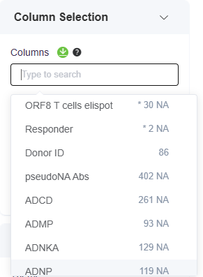

# Phase 1: Data Overview

### Purpose

The purpose of this phase is to examine the structure of the dataset, Specifically, the aim is to assess the different data types within the dataset, view their distributions for preliminary exploration, and identify missing values, which is especially common in longitudinal studies.&#x20;

### Action

<details>

<summary>1) Launch PANDORA</summary>

1. Open Docker and start the PANDORA container&#x20;

<figure><figcaption><p>PANDORA container on Docker Desktop</p></figcaption></figure>

1. Open Your Terminal:
   * On Windows, search for **PowerShell** in your Start menu and open it.
   * On MacOS or Linux, open the **Terminal** app.
2.  Run the Installation command:

    
    ```bash
    docker run --rm --detach --name genular --tty --interactive --env IS_DOCKER='true' --env TZ=Europe/London --oom-kill-disable --volume genular_frontend_latest:/var/www/genular/pandora --volume genular_backend_latest:/var/www/genular/pandora-backend --volume genular_data_latest:/mnt/usrdata --publish 3010:3010 --publish 3011:3011 --publish 3012:3012 --publish 3013:3013 genular/pandora:latest
    ```
    
3. Access PANDORA:
   * Open your browser and navigate to [http://localhost:3010](http://localhost:3010)

</details>

<details>

<summary>2) Data Upload </summary>

1. Navigate to **Workspace**&#x20;
2. Upload the `covid_pitch.csv` file onto the Workspace&#x20;
3. Select this dataset to start exploring and analyzing!&#x20;

<figure><figcaption><p>Selecting COVID Pitch dataset in Workspace </p></figcaption></figure>

</details>

<details>

<summary>3) Data Overview for Initial Exploration</summary>

1. Navigate to Data Overview by going to **Discovery -> Start -> Data overview**&#x20;

<figure><figcaption><p>Steps to access 'Data overview' on PANDORA</p></figcaption></figure>

2.  Select up to 5 variables for visualizing data distributions

    1. The first variable will be selected as the sorting variable&#x20;
    2. &#x20;Identify key columns: In this study, the data can be divided into several important categories- `Donor ID`, `Timepoints`, immunological assays, demographics, clinical symptoms, `Disease severity` and `Responders` . Hence, aim to view distributions that are representative of these categories&#x20;
    3.  Missing values (NA):  The number of missing values in each feature is provided during column selection. A star next to the number of NAs indicates that <10% of the values are NA in that feature&#x20;

        <figure><figcaption></figcaption></figure>


3) After selection of desired features, select 'Plot image', and the distribution and table plots will be generated for the selected columns&#x20;

As this dataset consists of both categorical and numerical features, [below](phase-1-data-overview.md#assessing-data-from-covid-pitch-dataset-by-data-types) is an example workflow of visualizing both data types.&#x20;

</details>

### Assessing Data from COVID Pitch dataset by data types



As there are multiple data types within this dataset, it is valuable to view the distributions of these data types. Here, we are analyzing the distributions of the categorical variables, specifically `Donor ID` (manually added to the dataset), `Responder`, `Disease Severity`, `Sex`, and `Change or loss of taste`.&#x20;

<figure><figcaption></figcaption></figure>

<figure><figcaption></figcaption></figure>



This is analysis of the numerical immunological assays with days as sorting&#x20;

<figure><figcaption></figcaption></figure>

<figure><figcaption></figcaption></figure>


