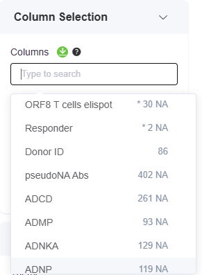

# Introduction

Use [this workflow](covid-pitch-workflow/) to explore the durability of humoral and cellular immune responses longitudinally after severe acute respiratory syndrome coronavirus 2 (SARS-CoV-2) infection. The dataset consists of 78 UK health workers who presented with symptomatic or asymptomatic infection prior to vaccination. Samples were collected from the participants over a period of 6 months.&#x20;

The **main objectives** are to:

1. **Visualize the trajectories of diverse immune responses over 6 months** after infection by analyzing how trajectories differ based on initial disease severity and the correlations between different immune parameters
2. **Predict pre-defined long-term antibody responder status based on early immune signatures**

The dataset can be downloaded from this [**Zenodo data repository**](https://zenodo.org/records/4905965) or from below:&#x20;



For more details, refer to the publication that describes the cohort and various analyses performed on the dataset:

[**Divergent trajectories of antiviral memory after SARS-CoV-2 infection**](https://doi.org/10.1038/s41467-022-28898-1)

(_Tomic, A., Skelly, D.T., Ogbe, A. et al. Nat Commun 13, 1251 (2022)_)

<figure><figcaption>
Figure 1. Clinical study overview
</figcaption></figure>

