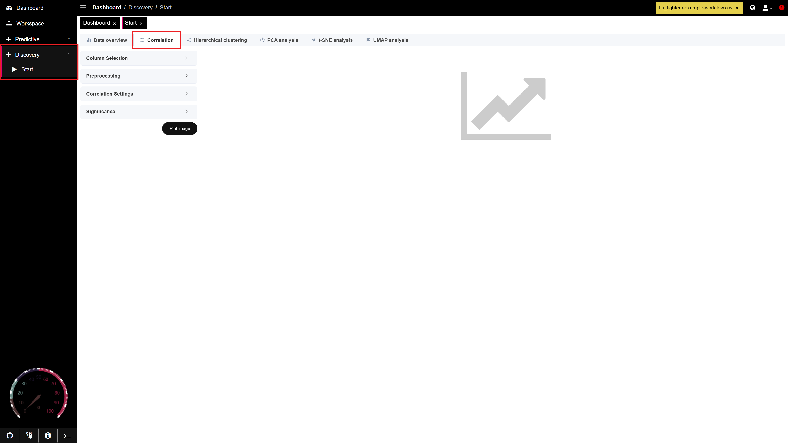

# Phase 1: Data Configuration

### Purpose

Perform an initial exploratory data analysis on the `flu_fighters.csv` dataset, including data upload, inspection of missing values, visualization of variable distributions, and identification of key correlations to guide further analysis.

***

### Action

<details>

<summary>1 - Launch Pandora</summary>

1. Open Docker and run PANDORA container

<figure><figcaption></figcaption></figure>

2. Open Terminal
   * On Windows, search for PowerShell in your Start menu and open it.
   * On MacOS or Linux, open the Terminal app.

3) Run Installation Command


```bash
docker run --rm --detach --name genular --tty --interactive --env IS_DOCKER='true' --env TZ=Europe/London --oom-kill-disable --volume genular_frontend_latest:/var/www/genular/pandora --volume genular_backend_latest:/var/www/genular/pandora-backend --volume genular_data_latest:/mnt/usrdata --publish 3010:3010 --publish 3011:3011 --publish 3012:3012 --publish 3013:3013 genular/pandora:latest
```


4. Access PANDORA:
   1. Open your browser and navigate to [http://localhost:3010](http://localhost:3010)


</details>

<details>

<summary>2 - Inspect Data</summary>

1. Navigate to **Workspace**

<figure><figcaption></figcaption></figure>

2. Upload the `flu_fighters.csv` dataset to **Workspace**

3) Select the uploaded `flu_fighters.csv` dataset

<figure><figcaption></figcaption></figure>

4. With the dataset selected, navigate to **Discovery** -> **Start**
   1. Select the **Data Overview** tab

<figure><figcaption></figcaption></figure>

5. Select up to 5 variables for inspection
   1. The first variable selected will be set as the sorting variable
   2. Examine missing values - The number of NAs per feature is provided when selecting your columns, a star next to that number indicates <10% of values are NA for a given feature
   3. In this example, baseline CD4+ IFN-γ responses to H1 (`h1_v0_cd4_ifng`)is set as the sorting variable and compared to CD4 cytokine fold change variables (`h1_cd4_ifng_fold_change`, `h3_cd4_ifng_fold_change`, `h1_cd4_il2_fold_change`)

<figure><figcaption></figcaption></figure>


### Handling Missing Values

Caution should be taken when using median imputation for features containing more than 10% missing values (NA). In these cases, you will want to check the dataset to ensure no bias in the missing values (ie, all high responders are missing a selected baseline measurement).




6. Plot image for the selected data

7) Examine the **Distribution Plot**
   1. This plot provides information about skewness, potential outliers, and correlations between variables.
   2. Based on the distribution plot generated in our example below, we see:
      1. The distribution plot for every selected feature is right-skewed, as shown in the figures along the diagonal.
      2. There is a significant correlation, as shown in the red boxes, between:
         1. `h1_v0_cd4_ifng` & `h1_cd4_ifng_fold_change`
         2. `h1_cd4_ifng_fold_change` & `h1_cd4_il2_fold_change`
         3. `h1_cd4_ifng_fold_change` & `h3_cd4_ifng_fold_change`
         4. `h1_cd4_il2_fold_change` & `h3_cd4_ifng_fold_change`
      3. There are significant outliers in some of the correlation plots, as shown by the red circles.

<figure><figcaption></figcaption></figure>

8. Select the **Table Plot** tab and examine the table plot
   1. This plot can be used to understand columns (predictors vs. outcomes), data types, and unique value counts.
   2. The leftmost variable is the sorting variable, arranging all rows from its largest to smallest values.
   3. Based on the table plot generated in our example below, we see:
      1. No apparent correlation (positive or negative) between the fold change variables and decreasing baseline cytokine levels.
      2. The data types for each variable are continuous and tend to range between -0.5 and 1 for the log of every variable.

<figure><figcaption></figcaption></figure>

**Repeat this process for all key baseline and outcome features of interest.**

</details>

<details>

<summary>3 - Explore Outcome Variable Relationships (Optional)</summary>

1. Navigate to **Discovery** -> **Correlation**

<figure><figcaption></figcaption></figure>

2.  Expand **Column Selection**

    1. Select all outcome columns (`fold_change`)

    

    b.  Choose **Correlation Method** `Spearman`

    

3)  Expand **Preprocessing**

    1. Remove the `medianimpute`

    

4.  Expand **Correlation Settings**

    1. Select **NA Action** `pairwise.complete.obs` from the dropdown

    

    b.  Select a desired **Plot method** for visualization

    

5) Set **Text size** to 1

6. Click the **Plot Image** button

7) Observe the correlation plot
   1. See documentation on [Correlation](https://app.gitbook.com/s/9LdC62ZpkxqvCBTPwVZU/data-analysis/discovery/correlation) for more information about interpreting the plot.

<figure><figcaption><p>Flu Fighters correlation plot for all fold_change variables</p></figcaption></figure>


</details>

***

### Summary

You've now uploaded your dataset and completed an initial inspection to understand variable types, distributions, and missing values. These initial steps ensure your data is clean and well understood before deriving any responder features and running predictive models.

