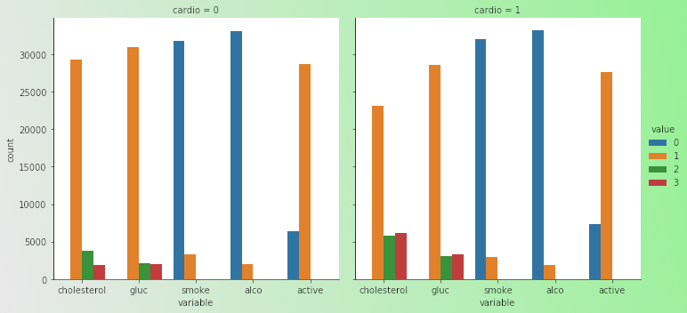

# Dataset Description

The dataset contains **input features** (Objective, Examination, Subjective) and a **target variable** indicating the presence or absence of cardiovascular disease. For our hypothetical trial, we will add a `TreatmentGroup` column.

| Feature Description                           | Category            | Variable Name | Data Type        | Coding / Unit                                    |
| --------------------------------------------- | ------------------- | ------------- | ---------------- | ------------------------------------------------ |
| Age                                           | Objective Feature   | `age`         | int              | days                                             |
| Height                                        | Objective Feature   | `height`      | int              | cm                                               |
| Weight                                        | Objective Feature   | `weight`      | float            | kg                                               |
| Gender                                        | Objective Feature   | `gender`      | categorical code | (e.g., 1: male, 2: female)                       |
| Systolic blood pressure                       | Examination Feature | `ap_hi`       | int              | mmHg                                             |
| Diastolic blood pressure                      | Examination Feature | `ap_lo`       | int              | mmHg                                             |
| Cholesterol                                   | Examination Feature | `cholesterol` | categorical      | 1: normal, 2: above normal, 3: well above normal |
| Glucose                                       | Examination Feature | `gluc`        | categorical      | 1: normal, 2: above normal, 3: well above normal |
| Smoking                                       | Subjective Feature  | `smoke`       | binary           | (e.g., 0: no, 1: yes)                            |
| Alcohol intake                                | Subjective Feature  | `alco`        | binary           | (e.g., 0: no, 1: yes)                            |
| Physical activity                             | Subjective Feature  | `active`      | binary           | (e.g., 0: no, 1: yes)                            |
| Presence or absence of cardiovascular disease | Target Variable     | `cardio`      | binary           | 

(e.g., 0: no, 1: yes)
              |

<figure><figcaption>
It can be clearly seen that patients with CVD have higher cholesterol and blood glucose level. And, generally speaking less active.
</figcaption></figure>

#### Input Features (Baseline & Examination)

These variables are measured at baseline or during examination periods.

<strong>👤 Objective Features</strong>

* `PatientID` (Hypothetical): Unique identifier for each patient.
* `Age`: Age | int (days)
* `Height`: Height | int (cm)
* `Weight`: Weight | float (kg)
* `Gender`: Gender | categorical code (e.g., 1 for male, 2 for female, or similar coding)
* `TreatmentGroup` (Hypothetical, added for the trial): Assigned treatment (`CardioGuard` or `Placebo`). **This is the key variable for assessing drug efficacy.**

<strong>🩺 Examination Features</strong>

* `ap_hi`: Systolic blood pressure | int
* `ap_lo`: Diastolic blood pressure | int
* `cholesterol`: Cholesterol level | 1: normal, 2: above normal, 3: well above normal (categorical)
* `gluc`: Glucose level | 1: normal, 2: above normal, 3: well above normal (categorical)

<strong>📝 Subjective Features</strong>

* `smoke`: Smoking | binary (0: no, 1: yes)
* `alco`: Alcohol intake | binary (0: no, 1: yes)
* `active`: Physical activity | binary (0: no, 1: yes)

#### Target Variable

This variable indicates the primary outcome of interest.

<strong>❤️ Cardiovascular Disease Status</strong>

* `cardio`: Presence or absence of cardiovascular disease | binary (0: no, 1: yes)

