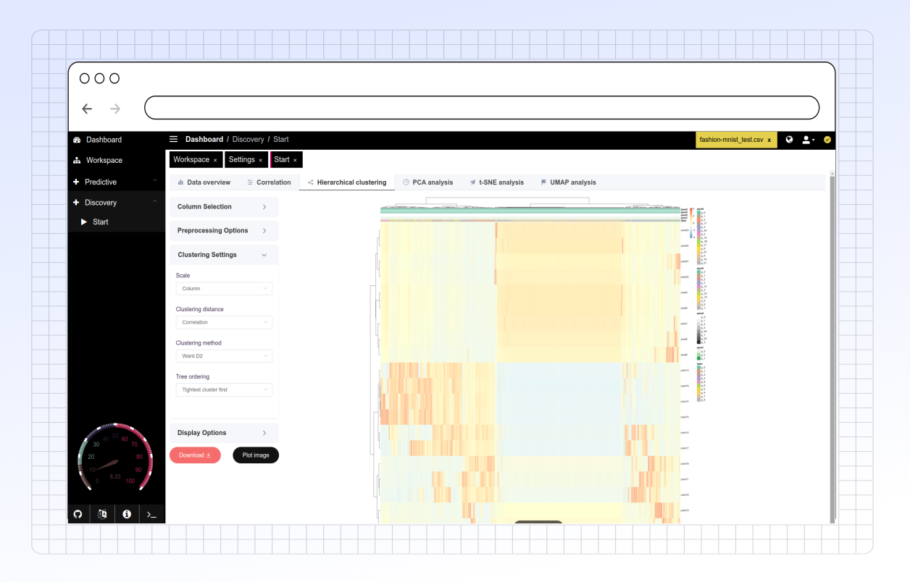

# Clustering

### **Overview**

The **Hierarchical Clustering** tab in PANDORA offers a toolset for clustering data. By providing options for data preprocessing, distance metrics, linkage methods, and display settings, users can generate customized dendrograms that reveal relationships within their datasets.&#x20;

<figure><figcaption></figcaption></figure>

### **Key Functionalities**

1. **Column Selection**:
   * **Columns**: Select specific columns for clustering analysis. Only valid columns (with enough unique values) are enabled.
   * **First (n) Columns**: Limit the number of columns used in the analysis, ranging from 1 to 15.
   * **Rows**: Select rows to include in the clustering analysis, typically limited to numeric values.
   * **First (n) Rows**: Specify the maximum number of rows to include in the analysis, with a range from 10 to 10,000.
2. **Preprocessing Options**:
   * **Preprocessing Steps**: Choose preprocessing steps like "medianImpute," "center," "scale," and more. These steps help in standardizing data and removing irrelevant features before clustering.
   * **Remove NA**: Toggle this option to remove rows or columns with missing values.
3. **Clustering Settings**:
   * **Scale**: Select the scaling method to apply (row, column, or none). Scaling can standardize data to make patterns more apparent.
   * **Clustering Distance**: Choose the distance metric for clustering, such as "correlation," "euclidean," "maximum," "manhattan," "canberra," "binary," or "minkowski." This determines how distances between data points are calculated.
   * **Clustering Method**: Select the linkage method for clustering, such as "single," "complete," "average," "mcquitty," "median," "centroid," "ward.D2," or "ward.D." This controls how clusters are formed based on distances.
   * **Tree Ordering**: Specify the tree ordering for displaying the dendrogram, affecting how clusters are visualized.
4. **Display Options**:
   * **Grouped Display**: Enable to display mean values of clusters on a heatmap.
   * **Grouped Column**: Choose a column for grouping data if "Grouped Display" is enabled. This option helps in organizing and visualizing grouped data more effectively.
   * **Display Elements**: Customize the elements shown on the plot, including "numbers," "legend," "column names," and "row names."
   * **Font Sizes**:
     * **General Font Size**: Set the font size for general text on the plot.
     * **Row Names Font Size**: Customize font size specifically for row names.
     * **Column Names Font Size**: Adjust font size for column names.
     * **Numbers Font Size**: Modify the font size for values displayed on the plot.
   * **Plot Width**: Adjust the width of the plot to ensure it fits well on various screen sizes.
   * **Plot Ratio**: Change the aspect ratio of the plot to optimize readability and fit on the display.
5. **Download Options**:
   * **Download Plot**: Users can download the clustering plot in SVG format for further analysis or presentation.

