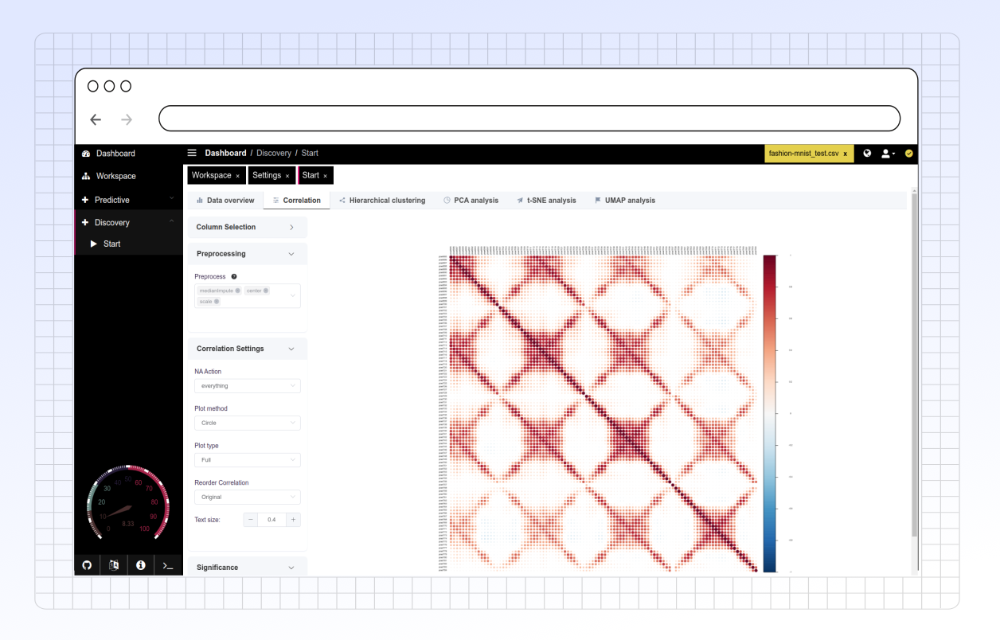

# Correlation

<figure><figcaption></figcaption></figure>

### **Key Functionalities**

1. **Column Selection**:
   * Allows users to select specific columns for the correlation analysis. Only columns with non-zero variance are enabled for selection.
   * **First (n) Columns**: Specify the number of initial columns to include in the analysis, with a range from 2 to 10,000.
   * **Correlation Method**: Choose a method for calculating correlation (Pearson, Kendall, or Spearman), each providing different insights into variable relationships.
2. **Preprocessing**:
   * **Preprocessing Options**: Users can choose preprocessing steps like "medianImpute," "center," "scale," and more. These steps help in standardizing data and handling missing values before analysis.
   * **Zero-Variance Removal**: Columns with zero variance are automatically excluded to prevent bias.
   * **Highly Correlated Features Removal**: Removes features that are highly correlated to avoid redundancy in the dataset.
3. **Correlation Settings**:
   * **NA Action**: Specify how missing values (NAs) are handled, with options like "everything," "all.obs," "complete.obs," "na.or.complete," and "pairwise.complete.obs."
   * **Plot Method**: Choose the visualization style for the correlation matrix, including "mixed," "circle," "square," "ellipse," "number," "shade," "color," and "pie."
   * **Plot Type**: Select the portion of the matrix to display—either full, lower, or upper triangle.
   * **Reorder Correlation**: Set the order for displaying correlations, such as "original," "AOE," "FPC," "hclust" (hierarchical clustering), or "alphabet."
4. **Significance and Confidence**:
   * **Significance**: Enable this option to test the significance of correlations. Adjust the p-value level and specify actions for insignificant values, such as marking them with symbols or leaving them blank.
   * **Confidence**: Set the confidence level for the correlation estimate. Choose different plotting methods (e.g., square, circle, rect) to represent confidence levels visually.
5. **Text Size and Download Options**:
   * **Text Size**: Adjust the size of text labels within the plot for better readability.
   * **Download Options**: Users can download the correlation matrix image (in SVG format) and the raw data for offline analysis.

### **Conclusion**

The **Correlation** tab in PANDORA provides a robust environment for exploring relationships between variables in a dataset. With flexible options for preprocessing, correlation method selection, and significance testing, users can tailor the analysis to suit their research needs. This feature helps identify patterns, detect multicollinearity, and decide on further analysis steps.
