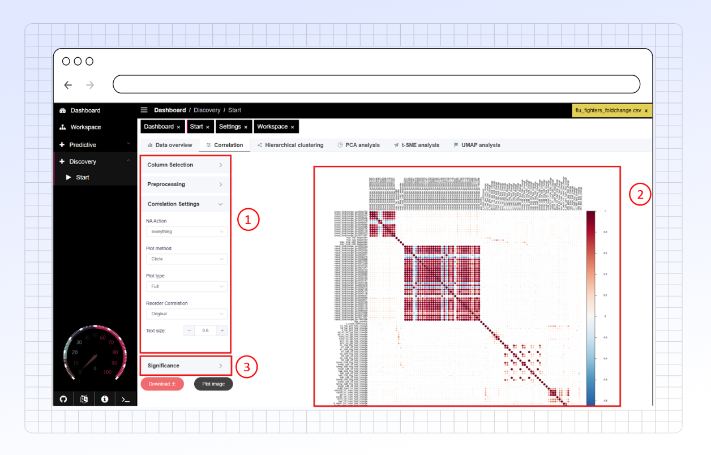
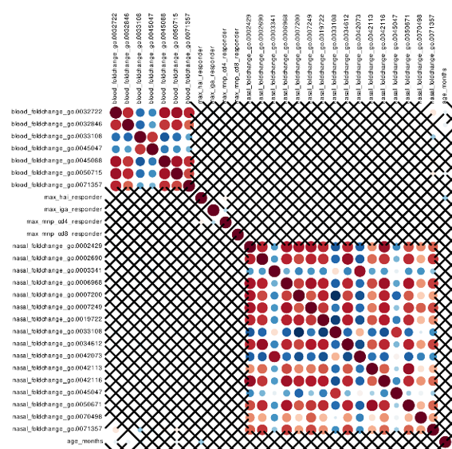

# Correlation

Use the **Correlation** tab to explore relationships between variables in your dataset. PANDORA creates correlograms (correlation plots) that help you visualize these connections.

You can easily see the strength and direction (positive or negative) of correlations between variables. Additionally, you can check the statistical significance (p-values) of these relationships to understand how reliable they are.

<figure><figcaption></figcaption></figure>



This section details the specific settings available in the **Correlation** tab. For general setup steps like column selection and standard preprocessing, refer to the main documentation sections on Side Panel Options and Preprocessing.

#### 1. Correlation Method

* In the **Column Selection** area (or a dedicated "Method" section), choose the statistical method used to calculate correlations:
  * **Pearson:** Standard correlation coefficient, measures linear relationships. Assumes data is normally distributed.
  * **Kendall:** Rank-based correlation, measures ordinal association. Less sensitive to outliers than Pearson.
  * **Spearman:** Rank-based correlation, measures monotonic relationships (how well the relationship can be described using a monotonic function). Also robust to outliers.

#### 2. Correlation Settings

* **NA Action:** Select how to handle missing values (NAs) during correlation calculation.
  * The default (`everything`) typically attempts to compute correlations whenever possible pairs of observations exist.
  * Other options (like `pairwise.complete.obs` or `complete.obs`) might be available, allowing you to use only complete pairs or only rows with no NAs across all selected variables. Refer to standard R `cor()` function documentation for detailed behavior of these options if needed.
* **Plot Method:** Choose how the correlation values are visualized within the plot matrix:
  * Options often include `circle`, `square`, `ellipse`, `number`, `shade`, `color`, `pie`. These determine the shape or shading used to represent the correlation strength and direction.
* **Plot Type:** Select which part of the correlation matrix to display:
  * `full`: Show the entire square matrix.
  * `upper`: Show only the upper triangle (excluding the diagonal).
  * `lower`: Show only the lower triangle (excluding the diagonal).
* **Reorder Correlation:** Choose how variables are ordered along the axes:
  * Options might include alphabetical order, or ordering based on clustering results (like Angular Order of Eigenvectors, `AOE`, or First Principal Component, `FPC`), or hierarchical clustering.
* **Hierarchical Clustering:** If you choose a reordering method based on hierarchical clustering (or enable a specific clustering option):
  * **Clustering Method:** Select the linkage algorithm (e.g., `ward`, `complete`, `average`) used to build the hierarchy.
  * **Number of Rectangles (Clusters):** If desired, specify the number of clusters (`k`) to highlight with rectangles drawn on the heatmap, based on cutting the dendrogram.

<figure><figcaption></figcaption></figure>

#### 3. Text Size

* **Axis Text Size:** Adjust the font size for the variable names displayed on the plot axes using `+`/`-` buttons or by entering a numeric value.



Interpreting the Correlogram

The main output of the **Correlation** tab is a correlogram, which visually represents the correlation matrix calculated based on your settings.

#### How to Read the Plot

* **Circles:** Each circle represents the correlation between two variables (one on the x-axis, one on the y-axis).
* **Size:** The **size** of the circle indicates the **strength (magnitude)** of the correlation. Larger circles mean stronger correlations (closer to 1 or -1), while smaller circles mean weaker correlations (closer to 0).
* **Color:**
  * **Reddish colors** indicate a **positive correlation** (as one variable increases, the other tends to increase).
  * **Bluish colors** indicate a **negative correlation** (as one variable increases, the other tends to decrease).
  * The **intensity** of the color also reflects the strength of the correlation, corresponding to the values shown on the color legend/bar on the right. Darker shades mean stronger correlations.

**Example 1: Few Variables**

<figure><figcaption>
This plot shows correlations between a small number of variables. You can easily see strong positive correlations (large dark red circles) between max_hai_responder and max_iga_responder, and weaker negative correlations (small light blue circles) like between max_hai_responder and h3_v0_seropositive.
</figcaption></figure>

**Example 2: Many Variables**

<figure><figcaption>
PANDORA's correlogram scales effectively even for datasets with many variables. This example reveals distinct blocks of highly correlated variables (clusters of dark red circles), which might indicate groups of related genes or biomarkers. You can also see areas with little correlation (very small, pale circles).
</figcaption></figure>



Beyond just showing the correlation strength, PANDORA allows you to assess the statistical reliability of these correlations.

#### Assessing Significance

You can perform statistical tests to see if the observed correlations are likely real or could have occurred by chance.

* **Enable Significance Test:** Check this option to calculate p-values for each correlation.
* **Significance Level (alpha):** Set the threshold (e.g., 0.05) to determine statistical significance. Correlations with a p-value _above_ this threshold are considered "insignificant".
* **Insignificant Action:** Choose how to visually mark correlations that are _not_ statistically significant on the plot:
  * `pch`: Places a cross (X) over insignificant correlations (see example below).
  * `p-value`: Displays the p-value number directly on the plot for insignificant correlations.
  * `blank`: Hides insignificant correlations entirely, leaving blank spaces.
  * `label_sig`: Adds significance stars (e.g. \*, \*\*, \*\*\*) based on p-value thresholds.
* **P-value Adjustment (BH):** Select this option to apply the Benjamini-Hochberg correction to the p-values. This is recommended when testing many correlations simultaneously (common in high-dimensional data) to control the false discovery rate.

#### 4. Visualizing Confidence Intervals

You can also visualize the uncertainty around the calculated correlation values.

* **Enable Confidence Interval:** Check this option to calculate and display confidence intervals (CIs) for the correlations.
* **Confidence Level:** Set the desired confidence level (e.g., 0.95 for a 95% CI). This determines the width of the interval.
* **CI Plotting Method:** Choose how the confidence interval is represented visually on the plot (often integrated with the main correlation shape). Options might include drawing lines or using different shapes.

#### Example: Significance and CI Visualization

The images below show correlograms where significance testing and confidence intervals are applied.

<figure><figcaption>
In this plot, correlations deemed not statistically significant (at the chosen alpha level, potentially after BH adjustment) are marked with a cross (X). This uses the pch setting for Insignificant Action.
</figcaption></figure>

**Example with Confidence Intervals Plotted (Square Method):**

<figure><figcaption>
This plot visualizes both the correlation (color/size) and its confidence interval. Here, the CI Plotting Method might be set to square or a similar option, where the shape or additional elements represent the calculated interval around the correlation estimate. The specific appearance depends on the chosen method.
</figcaption></figure>



**Download Options**: Users can download the raw data and plot images for offline analysis. Images are available in SVG format for scalability.

