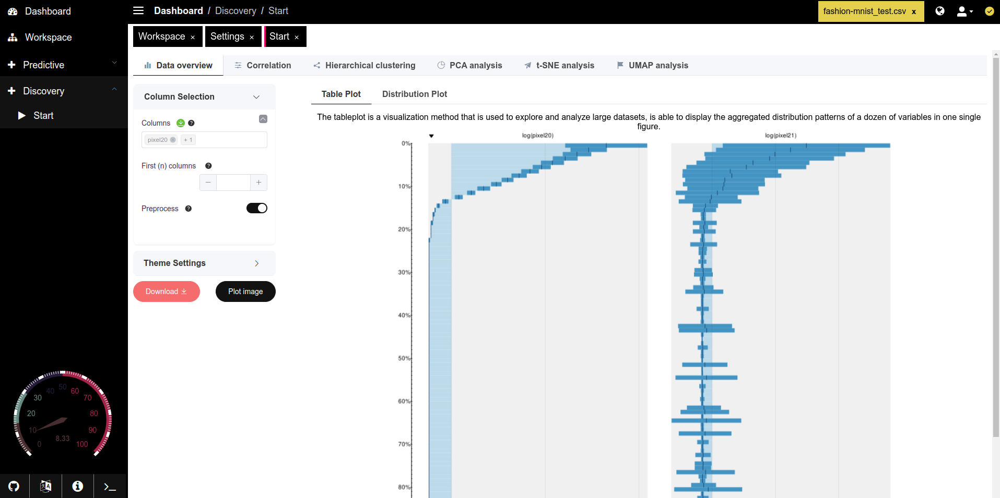

# Data Overview

### Overview&#x20;

The **Data Overview** tab in PANDORA offers comprehensive functionality for preliminary data inspection, allowing users to filter, preprocess, and visualize columns before diving into advanced analysis. This setup ensures that users can effectively manage data preprocessing, select appropriate columns, and tailor visual themes to their needs, making it a valuable tool in the initial stages of data exploration and preparation.

<figure><figcaption></figcaption></figure>

### **Key Functionalities**

1. **Column Selection**:
   * Allows users to choose specific columns for analysis. The dropdown is filterable and searchable to quickly find columns in large datasets.
   * **First (n) Columns**: Select the number of initial columns to display and analyze. This can be adjusted using an input field.
   * **Preprocess Toggle**: Enabling this option allows data preprocessing, preparing it for machine learning tasks. Preprocessing steps are typically required for clean and standardized data.
2. **Theme Settings**:
   * **Plot Theme**: Users can select from various themes, affecting the visual style of the plots. Themes range from basic to advanced, with colorblind-friendly options.
   * **Color Palette**: Choose a color palette to enhance visual clarity, with options for colorblind accessibility.
   * **Font Size**: Customize font size to ensure readability.
   * **Aspect Ratio**: Adjust the plot’s aspect ratio for optimal display and to fit various screen resolutions.
3. **Plot Options**:
   * **Table Plot**: This plot visualizes the data in a tabular format, allowing users to examine aggregated distribution patterns across multiple variables.
   * **Distribution Plot**: Displays the distribution of values in selected columns, which helps in identifying skewness, outliers, and patterns in the data.
   * **Download Options**: Users can download the raw data and plot images for offline analysis. Images are available in SVG format for scalability.
4. **Dynamic Tab Control**:
   * The tab will only be enabled if there is a sufficient amount of data in the selected file, preventing empty visualizations and optimizing performance.
5. **Bottom Bar Details**:
   * Shows additional details about selected columns, including:
     * Unique values count.
     * Whether the column is numeric (for PCA suitability).
     * Zero variance indication.
     * Percentage of missing values (NA).

