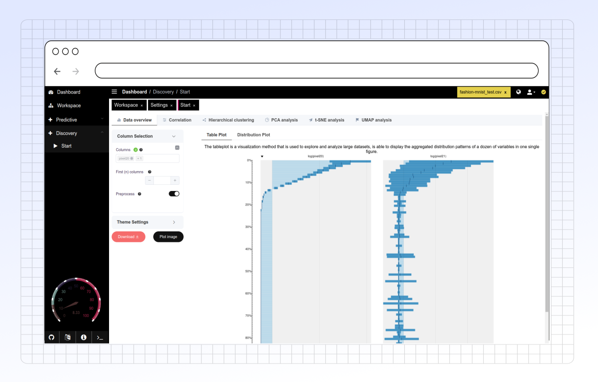

# Data Overview

Use the **Data Overview** tab for an initial look at your dataset. Here you can inspect, filter, preprocess, and visualize specific columns before starting more complex analyses.

<figure><figcaption>
Main overview
</figcaption></figure>



This plot visualizes the data in a tabular format, allowing users to examine aggregated distribution patterns across multiple variables.

<figure><figcaption>
<strong>Table Plot</strong>
</figcaption></figure>



Displays the distribution of values in selected columns, which helps in identifying skewness, outliers, and patterns in the data.

<figure><figcaption>
<strong>Distribution Plot</strong>
</figcaption></figure>



#### Key Features

* **Preliminary Inspection:** Get a quick summary and visualize distributions for selected columns.
* **Side Panel Controls:**
  * **Column Selection:** Choose which columns (variables) from your dataset you want to visualize.
  * **Preprocessing:** Apply basic preprocessing steps like normalization or handling missing values directly here. (See Preprocessing Options for details).
  * **Theme & Colors:** Customize the plot appearance using different themes and color palettes. (See Theme and Display Settings).
* **Download Options:**
  * Download the currently displayed plot as an SVG file (scalable vector graphic, good for publications).
  * Download the raw data subset currently being viewed (after any filtering/preprocessing applied in this tab).
* **Dynamic Activation:** This tab will only be active if your loaded dataset has sufficient data to display meaningful visualizations. This prevents errors with empty or very small datasets.
* **Bottom Information Bar:** When you select columns, this bar provides useful metadata about them:
  * Count of unique values.
  * Indication if the column is numeric (required for some analyses like PCA).
  * Flag if the column has zero variance (`zv`).
  * Percentage of missing values (NA).
