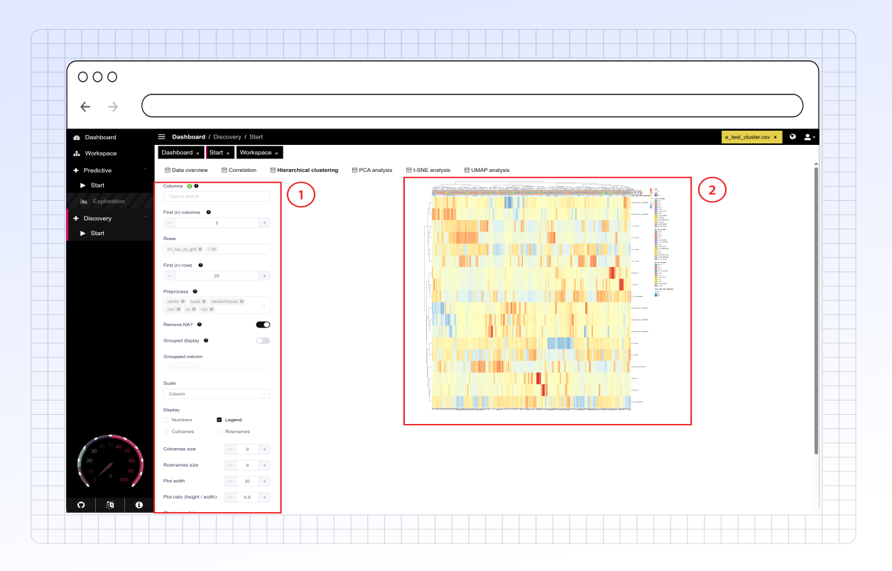

# Hierarchical Clustering

### Overview

Use the **Hierarchical Clustering** tab to group similar rows (e.g., samples, observations) and columns (e.g., genes, variables) in your data based on their values. This method creates a hierarchy of clusters, often visualized as a tree structure (dendrogram) alongside a heatmap.

<figure><figcaption></figcaption></figure>



Configure how the clustering is performed and how the results are displayed. For general options like column selection and basic preprocessing, see the main documentation sections. Settings specific to this tab include:

* **Scale (for Heatmap Coloring):** Choose how values are scaled before being mapped to colors in the heatmap. This affects visual appearance but not the clustering itself (unless scaling is also selected as a preprocessing step).
  * Row: Scale values within each row independently.
  * Column: Scale values within each column independently.
  * None: Use the original (potentially preprocessed) values without additional scaling for coloring.
* **Display:** Toggle the visibility of different plot elements:
  * Legend: Show or hide the color key legend for the heatmap.
  * Rownames: Show or hide the names of the rows along the side of the heatmap.
  * Colnames: Show or hide the names of the columns along the top/bottom of the heatmap.
  * Numbers: Display the actual scaled numeric values on the heatmap cells (useful for smaller heatmaps).
* **Colnames Size & Rownames Size:** Adjust the font size for the column and row labels using +/- buttons or by entering a numeric value.
* **Clustering Distance:** Select the metric used to measure the distance (dissimilarity) between data points (rows) and between variables (columns). Common options include Euclidean, Manhattan, Correlation-based distances, etc.
* **Clustering Method (Linkage):** Choose the algorithm used to merge clusters during the hierarchical process. Common options include ward.D2, complete, average, single. The choice affects the shape of the resulting clusters.
* **Tree Ordering:** Apply methods to optimize the ordering of branches within the dendrogram for better visualization, without changing the clustering hierarchy itself (e.g., based on leaf weights).



The main output is a heatmap combined with dendrograms:

* **Heatmap:** A grid where rows and columns are reordered based on the hierarchical clustering results. Cells are colored according to the scaled data values (as configured in the Scale setting), revealing patterns and blocks of similar values. Red/Warm colors typically indicate higher values, and Blue/Cool colors indicate lower values, relative to the chosen scaling method.
* **Dendrograms:** Tree-like diagrams displayed alongside the rows and columns. They illustrate how individual rows/columns are progressively merged into clusters based on similarity. The height of the branches indicates the distance at which clusters were merged.

<figure><figcaption>
This visualization helps you visually identify groups of rows and/or columns that behave similarly across your dataset and understand the hierarchical relationships between them.
</figcaption></figure>


