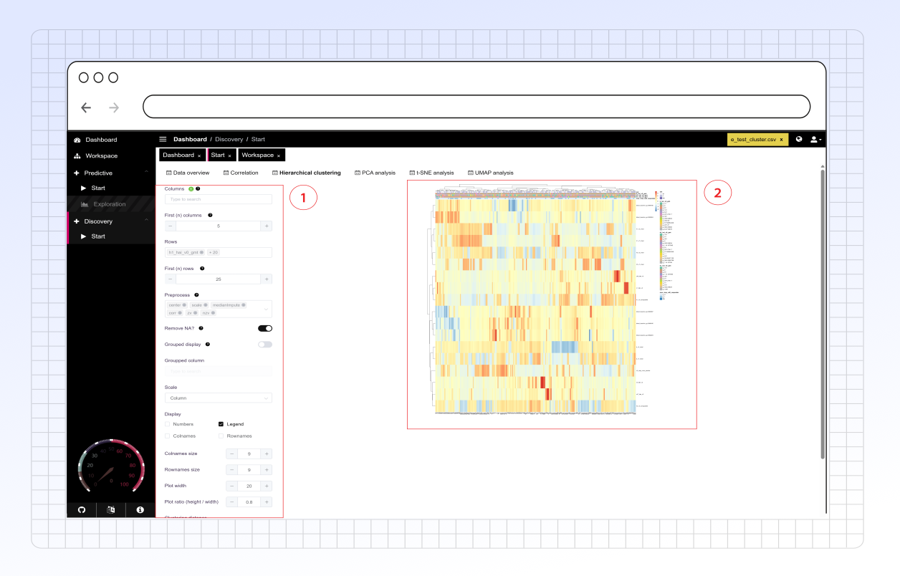

# Hierarchical Clustering

<figure><figcaption></figcaption></figure>



For generic setup steps and preprocessing options, please see the [Side Panel Options](side-panel-options.md) page. Information about the settings unique to Hierarchical Clustering setup is provided below:

* **Scale:** Select how the associated values for coloring in the heatmap are scaled
  * **Row:** Scaled according to other values in the same row of the heatmap
  * **Column:** Scaled according to other values in the same column of the heatmap
  * **None:** No scaling
* **Display:** Select if you would like to display the legend, row names, column names, or numbers for the clustered heatmap.
* **Colnames size & Rownames size:** Set the font size for the column and row names
* **Clustering distance:** Select the method for computing distance in the clustering algorithm.
* **Clustering method:** Select the method for cluster group formation.
* **Tree Ordering:** Determine the order in which the hierarchical branches (dendrogram) are formed.



The output hierarchical clustered heat map shows the scaled values for the selected rows and columns from the hierarchical clustering setup. Hierarchical clusters are also shown for the columns (at the top) and the rows (on the left side) via a dendrogram.

The hierarchical clustering output allows for visual assessment of groupings based on the heatmap and can be used to identify trends in the dataset..

<figure><figcaption></figcaption></figure>


