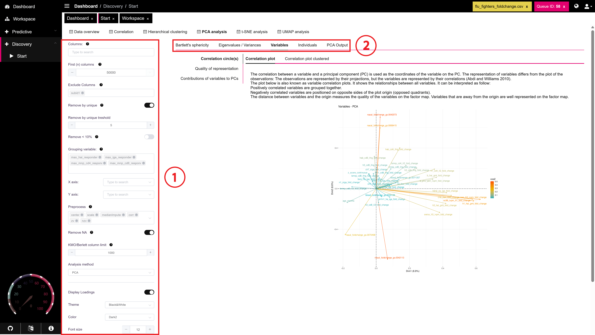

# PCA Analysis

Use the **PCA Analysis** tab to perform Principal Component Analysis (PCA). This is a powerful technique for **dimensionality reduction**, simplifying complex datasets by identifying the main axes of variation (principal components).

**Why use PCA?**

* **Exploratory Data Analysis:** Visualize high-dimensional biological data (like gene expression, proteomics, or flow cytometry data) in 2D or 3D plots to spot patterns, clusters, outliers, or batch effects among your samples.
* **Machine Learning Preparation:** Reduce the number of features (e.g., genes, proteins) before feeding data into machine learning models. This can:
  * Improve model performance by focusing on meaningful variation.
  * Reduce computational complexity and training time.
  * Help prevent overfitting by removing noise or redundant information.
* **Understanding Variance:** Identify which original variables contribute most strongly to the differences observed between samples or experimental conditions.

This tab provides tools to calculate principal components and visualize the results through various plots like scree plots, variable contribution plots, and sample scatter plots.

<figure><figcaption>
Main overview
</figcaption></figure>



Setup Options

* **Grouping Variable:**
  * Select a categorical variable from your dataset (e.g., 'treatment', 'cell\_type', 'batch').
  * **Important:** This variable is _only_ used for coloring or grouping points in the output plots (like the Individuals Plot). It does **not** influence the PCA calculation itself.
  * Use this to visually check if samples with the same label cluster together in the principal component space.
* **X and Y Axes:**
  * Choose which principal components (PCs) to display on the X and Y axes of the scatter plots (Individuals and Variables plots).
  * Defaults usually are PC1 (explains the most variance) for the X-axis and PC2 (explains the second most) for the Y-axis. You can change this to explore other dimensions (e.g., PC2 vs. PC3).
* **KMO/Bartlett Column Limit:**
  * Set a maximum number of columns (variables) for performing the Kaiser-Meyer-Olkin (KMO) measure of sampling adequacy and Bartlett's test of sphericity.
  * These tests help assess if your data is suitable for PCA. If your dataset has more columns than this limit, these tests will be skipped to save computation time.
* **Analysis Method:**
  * Choose the appropriate method based on your data type:
    * **PCA (Principal Component Analysis):** Use for **numerical** variables.
    * **MCA (Multiple Correspondence Analysis):** Use for **categorical** variables.
* **Display Loadings:**
  * Toggle this option ON to overlay variable loadings (arrows indicating variable contributions) onto the Individuals Plot. This helps relate sample positions to the influence of original variables. (Note: May clutter the plot if many variables are present).
* **Ellipse Options (for Grouping Variable):**
  * **Remove Ellipse:** Toggle this OFF to draw concentration or confidence ellipses around the groups defined by your **Grouping Variable** on the Individuals Plot. Toggle ON to hide these ellipses.
  * **Ellipse Alpha:** Adjust the transparency level (0 = fully transparent, 1 = fully opaque) of the group ellipses when they are displayed. Lower values make the ellipses fainter.



After the PCA is calculated, a panel (often on the right or as separate sub-tabs) displays detailed results and diagnostics.

#### 2. Analysis Options / Results Breakdown

* **Bartlett's Sphericity & KMO:**
  * Provides results for Bartlett's Test of Sphericity and the Kaiser-Meyer-Olkin (KMO) Measure of Sampling Adequacy.
  * **Bartlett's Test:** Checks if the correlation matrix is significantly different from an identity matrix (i.e., if variables are correlated enough to warrant PCA). A significant p-value (e.g., < 0.05) supports using PCA.
  * **KMO Index:** Measures the proportion of variance among variables that might be common variance. Values closer to 1 indicate the data is suitable for PCA; values below 0.5 or 0.6 are often considered problematic.
  * _Note: These tests are only performed if the number of columns is below the limit set in the PCA Setup._
* **Eigenvalues / Variances:**
  * Shows the eigenvalue, percentage of variance explained, and cumulative percentage of variance explained for each principal component (PC).
  * **Eigenvalue:** Represents the amount of variance captured by a specific PC. Larger eigenvalues correspond to more important components.
  * **Percentage of Variance:** The proportion of the total dataset variance that each PC accounts for.
  * **Cumulative Percentage:** The total variance explained by including the current PC and all preceding ones. This helps decide how many PCs to retain to capture a desired amount of total variance.
* **Variables:**
  * Provides details on how the original variables relate to the principal components. Key metrics include:
    * **Coordinates/Loadings:** Values indicating how strongly each original variable contributes to each PC (both magnitude and direction).
    * **Quality of Representation (cos2):** Measures how well a variable is represented by the selected principal components (sum of squared coordinates on those axes). Values close to 1 mean the variable is well-represented in the chosen dimensions.
    * **Contribution:** The percentage contribution of each variable to the variance of a specific principal component. Variables with high contributions are important for defining that PC.
* **Individuals:**
  * Provides details on how the individual samples (rows) relate to the principal components. Key metrics include:
    * **Coordinates:** The position (score) of each individual sample in the principal component space (e.g., its value on PC1, PC2, etc.).
    * **Quality of Representation (cos2):** Measures how well an individual sample's variance is captured by the selected principal components. Individuals with high cos2 are well-represented in the PCA plot.
    * **Contribution:** The percentage contribution of each individual sample to the variance of a specific principal component. Individuals with high contributions strongly influence the direction of that PC and might be outliers.
* **PCA Output:**
  * Often displays a summary table or snippet of the core PCA results, potentially including eigenvalues, variable loadings, and individual coordinates in a raw format.



