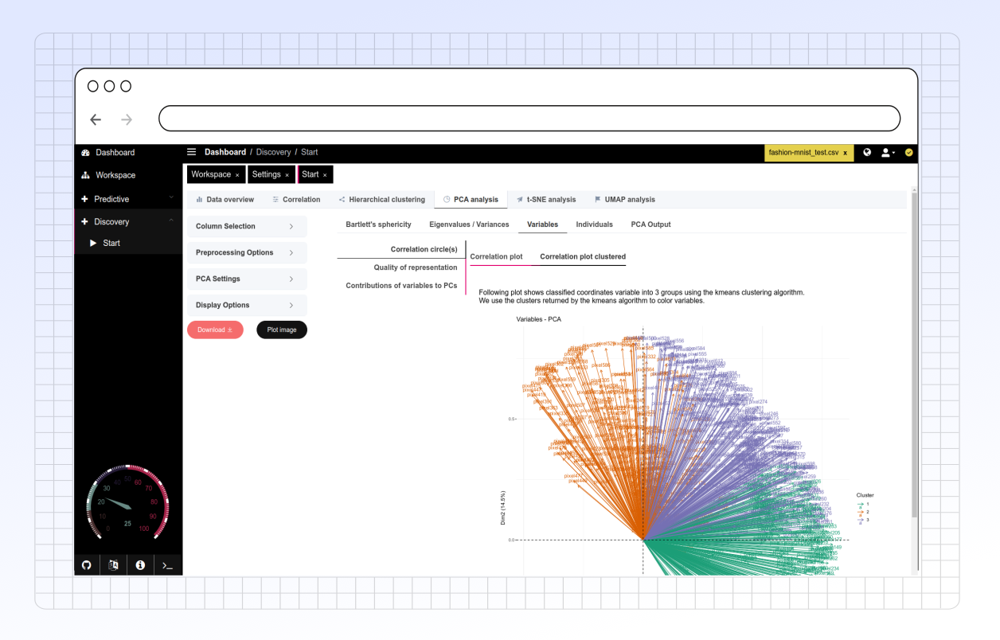

# PCA Analysis

### Overview

The **PCA Analysis** tab provides tools for dimensionality reduction and exploratory data analysis.

<figure><figcaption>
Main overview
</figcaption></figure>

### Key Functionalities

#### 1. Column Selection

* **Columns**: Choose specific columns for PCA analysis. If left empty, all numerical columns will be selected, excluding any specified in "Exclude Columns."
* **First (n) Columns**: Define the number of columns for analysis if no specific columns are selected, with values ranging from 2 to 50,000.
* **Exclude Columns**: Select any columns to exclude from analysis.

#### 2. Preprocessing Options

* **Remove by Unique**: Remove columns with fewer than a defined number of unique values.
* **Remove by Unique Threshold**: Specify the minimum number of unique values required to keep a column.
* **Remove < 10%**: Exclude columns with unique values less than 10% of total observations.
* **Preprocessing**: Choose steps such as "center," "scale," "medianImpute," "zv" (zero variance), and "nzv" (near-zero variance).
* **Remove NA**: Option to drop rows with missing values before processing.

#### 3. PCA Settings

* **Grouping Variable**: Select a variable to use for grouping. This variable won’t impact PCA computation but will be used for plotting.
* **X and Y Axes**: Choose which principal components to display on the X and Y axes.
* **KMO/Bartlett Column Limit**: Set a column limit for performing Kaiser-Meyer-Olkin and Bartlett tests.
* **Analysis Method**: Choose between PCA for numerical variables or MCA for categorical ones.
* **Display Loadings**: Enable this option to show variable loadings on the plot.

#### 4. Display Options

* **Label Size**: Customize the font size of variable labels.
* **Ellipse Alpha**: Set the transparency level of ellipses for grouping.
* **Remove Ellipse**: Toggle to remove or add ellipses around groupings.
* **Aspect Ratio**: Adjust the aspect ratio for the plot.
* **Plot Size**: Specify the plot’s overall size.

#### 5. Analysis Options

* **Bartlett's Sphericity**: Perform Bartlett’s test to determine if PCA is appropriate based on sphericity.
* **Eigenvalues / Variances**: View eigenvalues and variances to understand the significance of each principal component.
* **Variables**:
  * **Correlation Circles**: Show relationships between variables and PCs using a correlation circle plot.
  * **Quality of Representation**: Use cos2 values to evaluate how well variables are represented.
  * **Contributions to PCs**: View which variables contribute most to each PC.
* **Individuals**:
  * **Correlation Circles for Individuals**: Visualize individual observations in relation to PCs.
  * **Quality of Representation**: Assess cos2 values for individual representation quality.
  * **Contributions**: View contributions of individuals to each PC.
* **PCA Output**: Display detailed PCA results.

#### 6. Download Options

* **Download Plot**: Users can download plots as SVG files for further analysis or reporting.

