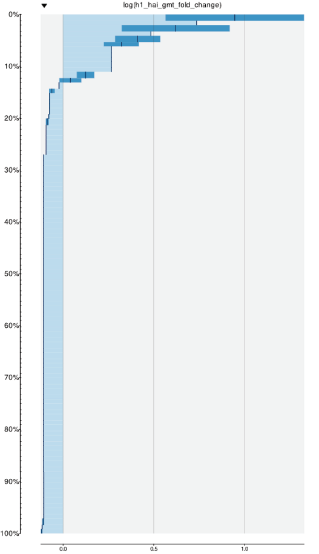
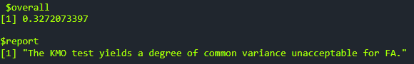

# Bartlett's Sphericity

### Overview

The **Bartlett's Sphericity** tab in PANDORA provides results from the Bartlett's Test of Sphericity and Kaiser-Meyer-Olkin (KMO) Index Test. The provided results can inform users on the suitability of their dataset to be used in principal component analysis and produce meaningful insights.

<figure><figcaption></figcaption></figure>



[**Bartlett's Test of Sphericity**](https://en.wikipedia.org/wiki/Bartlett's_test)**:** Used to determine whether the dataset is suitable for PCA. The results from this test are provided in the terminal output, which includes, from top to bottom, the chi-square value (chisq), the p-value, and the degrees of freedom (df).

* In general, if the p-value is less than 0.05, the dataset is suitable for principal component analysis.



[**Kaiser-Meyer-Olkin (KMO) test**](https://en.wikipedia.org/wiki/Kaiser%E2%80%93Meyer%E2%80%93Olkin_test)**:** Evaluates suitability of a dataset for factor analysis, including PCA. All results are provided in an output terminal. The overall measure provided is a value between 0 and 1, where a value closer to 1 indicates greater suitability of the dataset for factor analysis.

<figure><figcaption></figcaption></figure>



