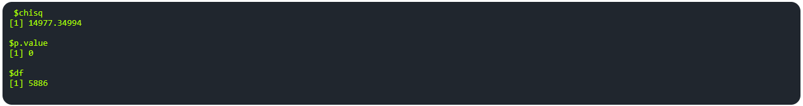

# Bartlett's sphericity

### Overview

The **Bartlett's Sphericity** tab in PANDORA provides results from the Bartlett's Test of Sphericity and Kaiser-Meyer-Olkin (KMO) Index Test. The provided results can inform users on the suitability of their dataset to be used in principal component analysis and produce meaningful insights.

<figure><figcaption></figcaption></figure>

### Key Features

1.  **Bartlett's Test of Sphericity:** Used to determine whether the dataset is suitable for PCA. The results from this test are provided in the terminal output, which includes, from top to bottom, the chi-square value (chisq), the p-value, and the degrees of freedom (df).

    * In general, if the p-value is less than 0.05, the dataset is suitable for principal component analysis.

    <figure><figcaption></figcaption></figure>
2.  **Kaiser-Meyer-Olkin (KMO) Index test:** Evaluates suitability of a dataset for factor analysis, including PCA. All results are provided in an output terminal. The overall measure provided is a value between 0 and 1, where a value closer to 1 indicates greater suitability of the dataset for factor analysis.

    * In general, an overall measure of 0.6 or above indicates that the dataset is adequate enough for PCA.

    <figure><figcaption></figcaption></figure>

