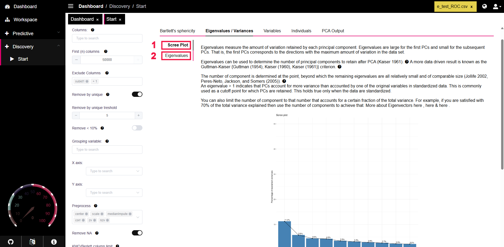

# Eigenvalues/Variances

### Overview

The **Eigenvalues/Variances** tab in PANDORA helps users investigate and understand the eigenvalue contribution to the principal component analysis.

<figure><figcaption></figcaption></figure>

**Eigenvalues** are a measure of the amount of variance retained by each principal component in PCA and are commonly used to determine the number of principal components to retain.



The [**scree plot**](https://en.wikipedia.org/wiki/Scree_plot) is used to identify principal components that contribute significantly to the PCA, and plots the eigenvalues from largest to smallest. The purpose of the scree plot is to determine the number of principal components to retain after PCA.

The number of principal components (PC) to retain for PCA can be determined through a number of methods, but the most common is the Scree Test.

* **Scree Test:** The number of principal components to retain is determined by the elbow of the scree plot. This is the point where the eigenvaleus remain relatively small and comparable in size.

<figure><figcaption>
Scree Plot
</figcaption></figure>



The **Eigenvalues** subtab provides a terminal output showing the variance contributions for each eigenvalue and its corresponding principal component. The columns of the table are explained below:

* **eigenvalue:** The eigenvalue corresponding to the dimension listed for the row
* **variance.percent:** The proportion of variance that each eigenvalue contributes is shown in the column&#x20;
* **cumulative.variance.percent:** Each successive principal component or dimension down the table adds to the total variance; the cumulating variance is shown in this column.

<figure><figcaption></figcaption></figure>


