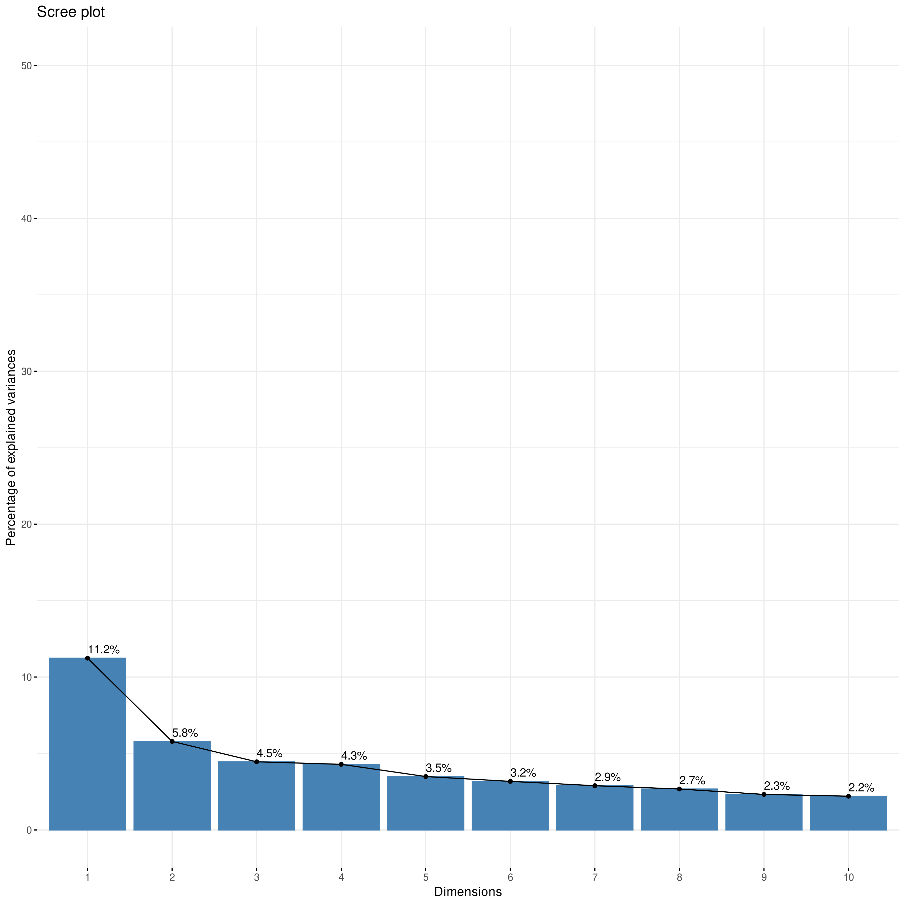
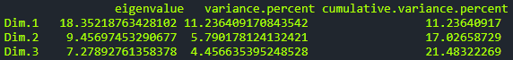

# Eigenvalues/Variances

This sub-tab shows the importance of each principal component (PC) calculated during the PCA. It helps you decide how many components are needed to capture most of the information (variance) in your original dataset.

<figure><figcaption></figcaption></figure>

**Eigenvalue:** A measure of the amount of variance explained by each principal component. Higher eigenvalues correspond to components that capture more variance. By definition, PCs are ordered from highest eigenvalue to lowest.



The Scree Plot is a key visualization associated with the **Eigenvalues / Variances** results. It helps you decide how many principal components (PCs) are meaningful and should be retained for further analysis.

<figure><figcaption>
Example Scree Plot showing percentage of explained variance per dimension
</figcaption></figure>

#### What it Shows

* The plot displays the **eigenvalues** or, more commonly, the **percentage of variance explained** (Y-axis) for each principal component (X-axis, labeled as Dimensions).
* Components are always ordered from left to right by decreasing order of variance explained (PC1 explains the most, PC2 the second most, and so on).

#### How to Interpret It: The Scree Test (Elbow Method)

* **Purpose:** The main goal is to find the point where adding more principal components doesn't significantly increase the explained variance.
* **Look for the "Elbow":** Examine the plot for a point where the curve bends sharply (like an elbow) and then flattens out.
  * The components **before** this elbow are generally considered the most important ones to retain, as they capture the majority of the meaningful variance in the data.
  * Components **after** the elbow often represent noise or smaller amounts of variance and might be discarded for dimensionality reduction.
* **Example Interpretation:** In the plot above, PC1 explains 11.2% of the variance, PC2 explains 5.8%, and PC3 explains 4.5%. The drop between PC1 and PC2 is significant. After PC3 or PC4, the amount of variance explained by each subsequent component decreases more slowly, and the line starts to flatten. Depending on the analysis goals, one might decide to keep the first 3 or 4 components based on this "elbow".

**Alternative Criteria:** While the elbow method is common, you can also decide how many PCs to keep based on the **Cumulative Variance Percent** shown in the Eigenvalues/Variances table (e.g., keep enough PCs to explain 80% or 90% of the total variance).



This sub-tab provides the numerical data behind the Scree Plot, usually presented in a table format, showing the importance of each principal component (Dimension).

<figure><figcaption>
Example table output showing eigenvalues and variance percentages
</figcaption></figure>

#### Understanding the Columns

* **eigenvalue:** This value represents the amount of variance captured by the specific principal component (Dimension) listed in that row. Larger eigenvalues indicate that the component explains more of the dataset's variability. Components are listed in descending order of their eigenvalues.
* **variance.percent:** This shows what percentage of the total variance in the dataset is explained by that single principal component.
* **cumulative.variance.percent:** This column shows the running total of the variance explained. For example, the value next to Dim.3 indicates the total percentage of variance captured by Dim.1, Dim.2, and Dim.3 combined.

#### How to Use This Table

This table gives you the precise numbers corresponding to the Scree Plot. You can use the cumulative.variance.percent column to decide exactly how many principal components to retain to meet a specific threshold (e.g., keeping enough components to explain 80% of the total variance).


