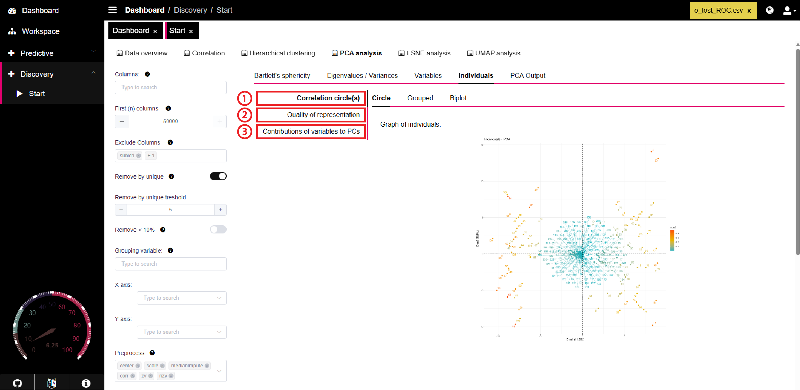

# Individuals

### Overview

The **Individuals** tab in PANDORA provides valuable insights on the correlation, quality, and contributions of each variable in the principal component analysis.

<figure><figcaption></figcaption></figure>



This sub-tab provides correlation circle plots of all individuals in a non-clustered and clustered form, and allows for comparison between individual contribution and variable contribution in the principal components. These plots can be downloaded as SVG files or right-clicked and saved as a PNG in PANDORA.

How to interpret a correlation circle:&#x20;

* Positively correlated variables are grouped together
* Negatively correlated variables are positioned opposite of each other about the origin of the plot
* The distance of a variable from the origin is a measure of its quality on the factor map. Variables located far from the origin are well represented on the factor map.

#### a. Circle

Provides a correlation circle between individuals and principal components with coloring based on the cos2 value for each individual. Learn more about correlation circles on the [PCA Analysis](../pca-analysis.md) page.

<figure><figcaption></figcaption></figure>

#### b. Grouped

Shown are the PCA results for each individual, with the grouping variable selected in the PCA setup overlayed for each individual in green and orange. Also shown are [concentration ellipses](https://search.r-project.org/CRAN/refmans/GDAtools/html/conc.ellipse.html) and [confidence ellipses](https://cran.r-project.org/web/packages/ConfidenceEllipse/vignettes/confidence-ellipse.html), which can help determine if the groups shown are significantly different.

<figure><figcaption></figcaption></figure>

#### c. Biplot

A plot combining the variable contribution correlation circle, and the grouped plot for individuals discussed in part b.

* **Points:** The points shown on the graph correspond to individuals and are colored according to the grouping variable, as in part b.
* **Ellipses:** The ellipses shown correspond to the confidence ellipses and concentration ellipses, as in part b.
* **Arrows:** Show variables and their corresponding contributions to the principal components. The variables are shown in a gradient of colors that corresponds with the contribution level.

<figure><figcaption></figcaption></figure>



Provides graphical information on how well each individual is represented on the primary principal components. The plots below can be downloaded as SVG files or right-clicked and saved as a PNG in PANDORA.

#### a. Correlation plot

The correlation plot shows how well each individual (listed on the side) is represented in each dimension (listed at the top). A dark red dot indicates greater representation of an individual in the associated principal component, and a dark blue dot corresponds to poor representation. The associated cos2 value for each color is shown on the right side bar

<figure><figcaption></figcaption></figure>

#### b. Bar plot

This bar plot shows the cos2 value associated with each individual. A high cos2 indicates good representation on the principal components, and so the corresponding individual would be shown further from the origin in the correlation circle. An individual with a low cos2 is poorly represented on the principal components, and would be shown closer to the origin in the correlation circle.

<figure><figcaption></figcaption></figure>



This sub-tab provides information on how much the individuals contribute to the variance in the principal components. The plots provided in PANDORA for this section can be downloaded as SVG files or right-clicked and saved as a PNG.

#### a. Correlation plot

The correlation plot shows how well each individual (listed on the side) is represented in each dimension (listed at the top). A dark red dot indicates greater variance contribution from the individual in the associated principal component, and a dark blue dot corresponds to poor variance contribution. A key is shown in the right sidebar for the gradient of color where the numbers correspond to the percent contribution to variability in the principal component..

<figure><figcaption></figcaption></figure>

#### b. Bar plot

Shows the top 10 individuals that contribute to the variance of the principal components

<figure><figcaption></figcaption></figure>

#### c. Other

Provides a correlation circle between individuals and principal components with coloring based on the contribution value for each individual. Learn more about correlation circles on the [PCA Analysis](../pca-analysis.md) page.

<figure><figcaption></figcaption></figure>



