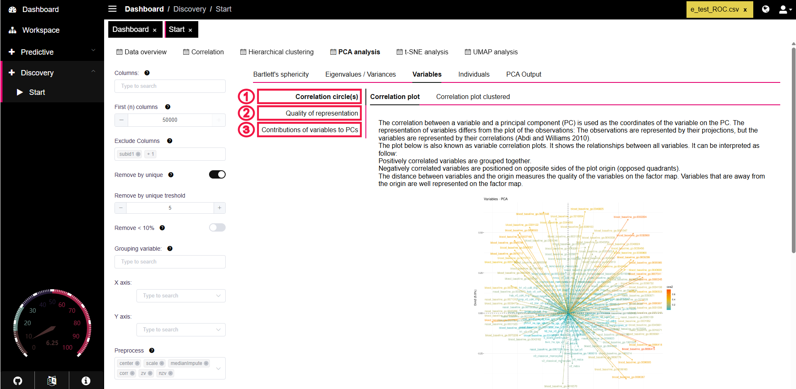

# Variables

This sub-tab focuses on the **relationship between your original variables (columns) and the principal components (PCs)** that were calculated. It helps you understand which variables drive the variance captured by each PC and how well the variables are represented in the reduced PCA space.

<figure><figcaption></figcaption></figure>



This visualization within the **Variables** sub-tab helps you understand how your original variables relate to the principal components (PCs) and to each other in the reduced PCA space. It's often called a "Correlation Circle" or "Loadings Plot".

PANDORA typically provides two versions of this plot:

1. **Correlation Plot (Colored by Quality):** Variables colored based on how well they are represented in the plot.
2. **Correlation Plot Clustered:** Variables colored based on cluster analysis performed on their PCA coordinates/loadings.

<figure><figcaption>
Correlation circle colored by Cos2 (Quality)
</figcaption></figure> <figure><figcaption>
Correlation circle colored by Cluster
</figcaption></figure>

#### How to Interpret the Correlation Circle

* **Variables as Arrows:** Each arrow represents one of your original variables. The endpoint of the arrow shows the variable's coordinates on the chosen principal components (typically PC1 on the X-axis and PC2 on the Y-axis).
* **Correlation with PCs:**
  * Variables with arrows pointing strongly towards the right have high positive correlations with PC1.
  * Variables pointing strongly towards the left have high negative correlations with PC1.
  * Variables pointing strongly upwards have high positive correlations with PC2, and downwards indicate negative correlations with PC2.
* **Relationship Between Variables:**
  * **Positively Correlated:** Variables whose arrows point in roughly the **same direction** are positively correlated with each other.
  * **Negatively Correlated:** Variables whose arrows point in roughly **opposite directions** (across the origin) are negatively correlated with each other.
  * **Uncorrelated:** Variables whose arrows are roughly **perpendicular (90 degrees)** are likely uncorrelated.
* **Quality of Representation (Distance from Origin):**
  * The **further** an arrow extends from the origin (center), the **better** that variable's variance is represented by the two principal components shown in the plot. Variables close to the origin are not well represented in this specific 2D view (their variance might be explained by other PCs not plotted).

#### Specific Plot Types

1. **Correlation Plot (Colored by cos2):**
   * In this version, the color of each arrow typically indicates its **quality of representation (cos2)** on the factor map (the current plot).
   * Warmer colors (like red/orange) usually signify higher cos2 values, meaning the variable is well-represented in this plot. Cooler colors (like blue/green) indicate lower cos2 values.
2. **Correlation Plot Clustered:**
   * This plot applies a clustering algorithm (like k-means) to the variables based on their coordinates (loadings) on the principal components.
   * Variables are colored according to the cluster they belong to. This helps visually identify groups of variables that have similar profiles or contributions across the principal components.

#### Download Options

You can usually download these plots as SVG files (recommended for scalability) or right-click to save them as PNG images directly from PANDORA.



This section within the **Variables** sub-tab provides plots that specifically focus on the **quality of representation (cos2)** for each variable in the principal component analysis. This helps you understand how well the variance of each original variable is captured by the principal components you are examining (typically the first few).

#### Plots for Assessing Variable Quality

1.  **Variable Representation per Dimension (Dot Plot / Heatmap):**

    * **What it shows:** This plot displays how strongly each variable (listed on the Y-axis) contributes to or is represented by each selected principal component/dimension (listed on the X-axis, though sometimes only the first few are shown).
    * **How to read it:**
      * The color and/or size of the dot at the intersection of a variable and a dimension indicates the strength of the relationship (often the squared coordinate or contribution).
      * Darker/larger dots (e.g., dark red in the example) indicate a stronger representation or contribution of that variable to that specific dimension.
      * Lighter/smaller dots (e.g., dark blue) indicate a weaker representation.
      * The color bar/legend shows the scale for these values (often related to squared coordinates or contributions).
    * **Use:** Quickly identify which variables are most strongly associated with each individual principal component.

    <figure><figcaption></figcaption></figure>
2.  **Total Quality of Representation (Bar Plot):**

    * **What it shows:** This bar plot displays the overall quality of representation (total `cos2`) for each variable, summed across the selected principal components (usually the ones plotted, e.g., Dim 1 and Dim 2). Variables are typically sorted from highest cos2 to lowest.
    * **How to read it:**
      * Variables with **longer bars** (higher `cos2` values) are well-represented by the selected principal components. Their position in the **Variables Plot (Correlation Circle)** is reliable, and they will appear further from the origin.
      * Variables with **shorter bars** (lower `cos2` values) are poorly represented by the selected PCs. Their position in the Correlation Circle (often close to the origin) might be misleading, as most of their variance lies in other dimensions.
    * **Use:** Identify which variables are adequately captured by your main PCA dimensions and which ones are not. This helps validate interpretations made from the Correlation Circle.

    <figure><figcaption></figcaption></figure>



This section within the **Variables** sub-tab focuses on how much each original variable **contributes** to the variance captured by the principal components (PCs). Identifying high-contribution variables is crucial for interpreting what biological or experimental factors each PC represents.

#### Plots for Assessing Variable Contribution

1.  **Contribution per Dimension (Dot Plot / Heatmap):**

    * **What it shows:** Similar to the quality plot, this displays the contribution of each variable (Y-axis) to each specific principal component/dimension (X-axis).
    * **How to read it:**
      * The color and/or size of the dot represents the **percentage contribution** of that variable to the variance of that specific dimension.
      * Darker/larger dots (e.g., dark red) indicate a higher contribution. Variables with high contributions heavily influence the direction and variance of that PC.
      * Lighter/smaller dots (e.g., dark blue) indicate a lower contribution.
      * The legend/color bar shows the contribution percentage scale.
    * **Use:** Identify the key variables driving the variance for each individual PC.

    <figure><figcaption>
Dot plot showing variable contribution per dimension
</figcaption></figure>
2.  **Top Contributing Variables (Bar Plot):**

    * **What it shows:** This bar plot highlights the variables with the highest contribution, typically summed across the selected principal components (e.g., Dim 1 and 2). Often, only the top N (e.g., top 10) contributing variables are shown, sorted from highest contribution to lowest.
    * **How to read it:**
      * Variables with **longer bars** contribute more to the variance captured by the selected dimensions. These are the most influential variables for the overall structure seen in the PCA plot (like the Individuals plot).
      * The **dashed red line** often indicates the expected average contribution level if all variables contributed equally. Variables extending beyond this line contribute more than average.
    * **Use:** Quickly identify the most important variables driving the separation or patterns observed in your main PCA plots (e.g., PC1 vs PC2).

    <figure><figcaption>
Bar plot showing top contributing variables to selected dimensions
</figcaption></figure>
3.  **Correlation Circle (Colored by Contribution):**

    * **What it shows:** This is the same Variables Plot (Correlation Circle) as described before, but here the arrows representing variables are colored based on their **contribution** level (summed across the displayed PCs).
    * **How to read it:**
      * Warmer colors (like red/orange) typically indicate higher contributing variables.
      * Cooler colors (like blue/green) indicate lower contributing variables.
      * Interpret the direction and length of arrows as described previously (correlation with PCs, relationship between variables, quality of representation). The color adds information specifically about influence.
    * **Use:** Visualize the relationships _and_ the importance (contribution) of variables simultaneously.

    <figure><figcaption>
Correlation circle colored by contribution
</figcaption></figure>

#### 4. Dimension Description (Terminal Output)

* **What it shows:** Provides a text-based output, often focusing on **Principal Component 1 (Dim.1)**. For quantitative variables, it typically lists the correlation coefficient between each variable and PC1, along with the associated p-value for that correlation.
* **Use:** Get precise numerical values and statistical significance for the relationship between each variable and the primary axis of variation (PC1). This can supplement the visual interpretations from the plots.


