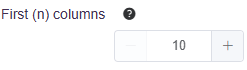

# Side Panel

The **Side Panel Options** presents the common tools and settings the user can find in the side panels for the tabs in Discovery



The side panels in the **Discovery** section tabs contain common tools for selecting data and configuring analyses. Here are the typical options for choosing which parts of your dataset to analyze:

#### Selecting Data / Columns

PANDORA provides several ways to specify the columns (variables) you want to work with:

* **Columns:**
  * Select specific columns by name using the dropdown menu.
  * You can type in the dropdown to search and filter, making it easy to find columns even in large datasets.
* **First (n) columns:**
  * Use this option to quickly select the first `n` columns from your dataset for analysis.
  * Adjust the number `n` using the input field or the `+`/`-` buttons.
* **Exclude Columns:**
  * (Available in some tabs) Remove specific columns that you _don't_ want to include in the current analysis.
  * Similar to the "Columns" selector, this dropdown is searchable and filterable.

<figure><figcaption></figcaption></figure>

<figure><figcaption></figcaption></figure>

<figure><figcaption></figcaption></figure>



You can apply these individually or combine them. Preprocessing often improves the results of downstream analyses.

* **Center:** Subtracts the mean value of each variable (column) from all its data points. This centers the data around zero.
* **Scale:** Divides the values of each variable by its standard deviation. This scales the data to have a unit standard deviation. Often used together with `Center`.
* **knnImpute:** Fills in missing values (NAs) using the k-Nearest Neighbors algorithm. It finds rows with similar data patterns to the row with the missing value and uses their values to estimate the missing one.
* **bagImpute:** Fills in missing values using bagged (Bootstrap Aggregated) regression trees. It builds multiple decision trees on bootstrapped samples of the data and averages their predictions to impute missing values.
* **medianImpute:** Fills in missing values within a variable using the median value of that variable's non-missing data. A simple and robust method.
* **corr (Correlation Filter):** Calculates the correlation between pairs of variables and removes variables that are highly correlated (above a certain threshold). This reduces redundancy and can simplify models.
* **zv (Zero Variance):** Removes variables that have zero variance (i.e., all values are the same). These variables provide no information for analysis or modeling.
* **nzv (Near-Zero Variance):** Removes variables that have very little variance (close to zero). These variables often provide little information and can sometimes cause issues in modeling.



Customize the appearance of your plots in PANDORA to suit different needs, like presentations, publications, or personal preferences.

* **Theme:** Choose from predefined themes that control elements like background color, gridlines, and overall plot aesthetics. Different themes are optimized for different outputs (e.g., a clean theme for publications, a dark theme for presentations).
* **Color Palette:** Select from various color palettes for your plots.
  * To find colorblind-friendly options, hover over the information icon (ⓘ) next to the color palette selector – palettes suitable for colorblindness will be indicated.
* **Font Size:** Adjust the size of text elements (axis labels, titles, etc.) on the plot. Use the `+` and `-` buttons or enter a specific number.
* **Plot Ratio/Size:** Control the aspect ratio or overall dimensions of the generated plot figure. This helps ensure the plot fits well in documents or slides.



