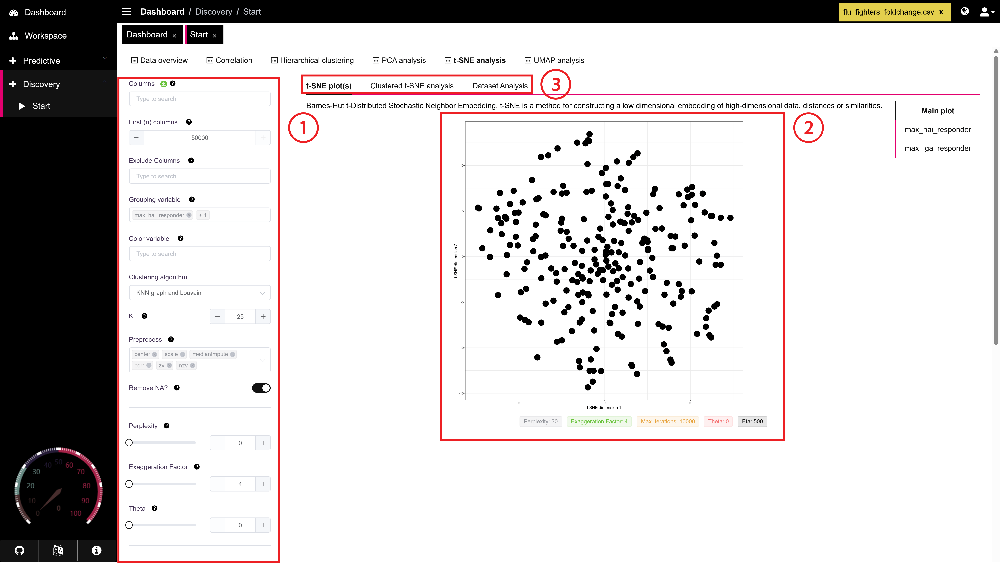

# t-SNE Analysis

### Overview

The **t-SNE Analysis** tab allows users to visualize high-dimensional data by projecting it into a low-dimensional space. Unlike PCA, which is also a dimensionality reduction algorithm, tSNE uses a nonlinear dimensionality reduction algorithm, making it more suitable for nonlinear datasets.

<figure><figcaption></figcaption></figure>



For generic setup steps and preprocessing options, please see the [Side Panel Options](../side-panel-options.md) page. Information about the settings unique to the t-SNE setup is provided below:

### T-SNE Hyperparameter setup

Each of these hyperparameters affects the performance of the t-SNE analysis. Optimal hyperparameter values vary by dataset. **PANDORA can automatically determine the optimal values for the hyperparameters** if these settings are not adjusted by the user.

* **Perplexity**: Adjust the perplexity, affecting how many neighbors each point considers. Suitable values range from 5 to 50, depending on the dataset.
* **Exaggeration Factor**: Set a factor to increase or decrease the separation between clusters. Typical values are between 4 and 30.
* **Theta**: Choose a theta value to control the accuracy/speed trade-off for the t-SNE approximation.
* **Max Iterations**: Define the maximum number of iterations (or steps) for the t-SNE algorithm, up to 50,000. At a minimum, enough iterations are needed to reach stability.
* **Learning Rate (Eta)**: Set the learning rate, controlling the step size in the t-SNE optimization. A lower eta may require a larger number of iterations to reach stability.

### Clustered t-SNE settings

These settings are specific to the clustered t-SNE analysis.&#x20;

* **Clustering Algorithm**: Choose the clustering algorithm, such as Louvain, Hierarchical, Mclust, or Density-based clustering. Each clustering algorithm has its own configuration variable, which are provided below.
  * KNN graph and Louvain
    * **K:** K nearest neighbors, each point will be assigned a cluster according to the majority cluster value out of the k nearest points, where k is the value you set here.
  * Hierarchical Clustering
    * **Clustering Method:** Determine what method to use for the merging of clusters within the hierarchical clustering.
  * Mclust & Density-based clustering
    * **epsQuantile:** Parameter controlling the density threshold for clustering. A high value increases the size of the neighborhood for clustering.

### Dataset Analysis Settings

The dataset analysis is performed on the clusters created from the clustered t-SNE. Users can toggle the settings below for this analysis.

* **Dataset Analysis Type**: Select the analysis type, such as heatmap or hierarchical clustering. This analysis is performed on each cluster in the clustered t-SNE.
* **Grouped Display**: Display the mean values of clusters on a heatmap.

### Optional Settings

* **Grouping Variable**: Select a categorical variable to group data points by color on the t-SNE plot. This variable is excluded from the analysis but used for visualization.
* **Color Variable**: Choose a continuous variable for coloring the t-SNE plot. Unlike the grouping variable, this variable is included in the analysis.



The [t-SNE](https://en.wikipedia.org/wiki/T-distributed_stochastic_neighbor_embedding) plot allows users to identify trends or clusters in the dataset. Some key points that are important to note when interpreting the t-SNE graph:

* Every dot displayed is a specific sample (ie, an individual in a study).
* The **axes are not directly interpretable**. As a result, little information can be drawn from the distances between each cluster identified in the t-SNE plot.
* t-SNE primarily **preserves local structure** over global structure in a dataset.
* **t-SNE performance heavily depends on hyperparameter settings**, which PANDORA can conveniently automatically set for optimal t-SNE performance.

<figure><figcaption></figcaption></figure>

Additional information is provided below the t-SNE plot about hyperparameter values. This can help with fine-tuning the hyperparameters for optimal model performance.

<figure><figcaption></figcaption></figure>



After running t-SNE, on the right of the side panel, the user will see results for several analyses.

* [t-SNE plot(s)](t-sne-plot-s.md): This tab displays t-SNE plots for the overall dataset and for any selected grouping or color variables.
* [Clustered t-SNE analysis](clustered-t-sne-analysis.md): This tab provides information on the output from t-SNE after clustering has been performed. It is designed to help users identify trends for the dataset in the reduced dimension.
* [Dataset Analysis](dataset-analysis.md): Depending on the selected setting, performs analysis to display a heatmap or hierarchical clustered analysis of the clusters identified from the clustered t-SNE analysis. This allows the user to identify key differences in feature values between each cluster group.



