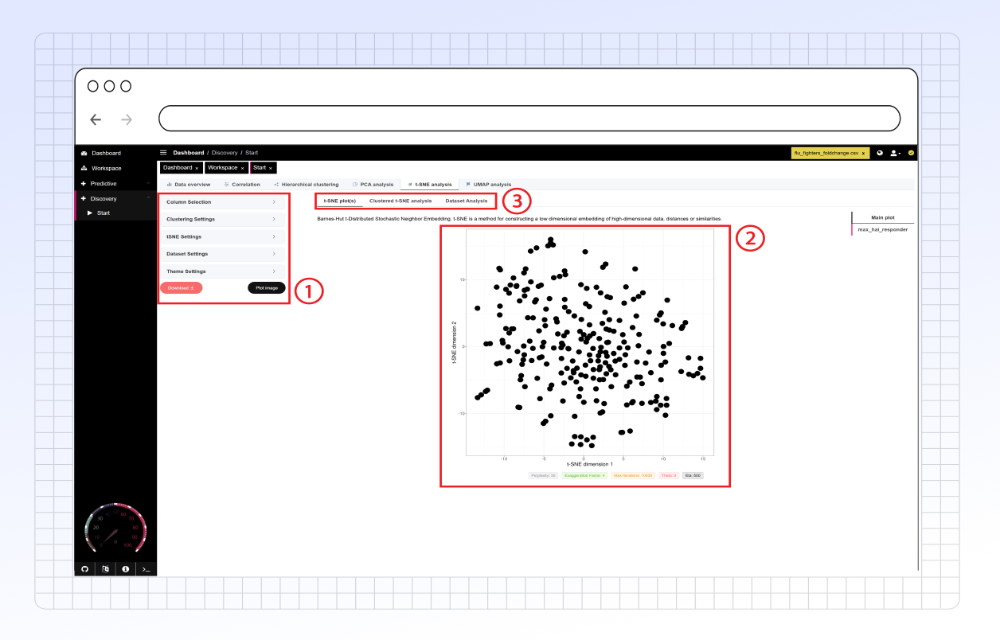

# t-SNE analysis

Use the **t-SNE (t-distributed Stochastic Neighbor Embedding)** tab to visualize high-dimensional data in a low-dimensional map, typically 2D.

t-SNE is particularly good at revealing **local structure** and **clusters** within your data. It works by modeling similarities between high-dimensional data points and representing them as probabilities, then finding a low-dimensional embedding that preserves these similarities.

Unlike PCA, t-SNE uses a **non-linear** algorithm. This often makes it better suited for visualizing complex datasets where relationships aren't linear, such as identifying distinct cell populations in single-cell RNA sequencing (scRNA-seq) data.

Keep in mind:

* t-SNE is primarily for **visualization**, not necessarily for preserving global distances accurately. The distances _between_ clusters in a t-SNE plot might not be meaningful.
* The resulting plot can depend heavily on the chosen parameters (like perplexity).

<figure><figcaption></figcaption></figure>



Configure the t-SNE calculation and visualization using the options in the side panel. For general setup like initial column selection and standard preprocessing, refer to the main documentation sections.

#### 1. t-SNE Hyperparameter Setup

These parameters control the core t-SNE algorithm. Finding optimal values often requires experimentation, but PANDORA may provide automatic optimization or reasonable defaults.

* **Perplexity:**
  * Related to the number of nearest neighbors considered for each point. It balances attention to local vs. global aspects of the data.
  * Typical values range from 5 to 50. Lower values emphasize local structure; higher values consider more neighbors.
* **Exaggeration Factor:**
  * Controls how much the natural clusters in the data are separated from each other during the initial optimization phase. Higher values can create more space between clusters.
  * Typical values might range from 4 to 30.
* **Theta:**
  * Controls the trade-off between speed and accuracy for the Barnes-Hut approximation used in t-SNE.
  * Lower values (e.g., 0) are more accurate but slower. Higher values (e.g., 0.5 to 1) are faster but less accurate.
* **Max Iterations:**
  * The maximum number of optimization steps the algorithm will run.
  * Should be high enough for the embedding to stabilize (often 1000 or more). PANDORA allows up to 50,000.
* **Learning Rate (Eta):**
  * Controls the step size during the optimization process.
  * Typical values might be around 200. If the learning rate is too high, the embedding might diverge; if too low, it might take many iterations to converge.

#### 2. Clustered t-SNE Settings

These settings apply specifically when generating the **Clustered t-SNE Plot**, which runs a clustering algorithm on the 2D t-SNE results.

* **Clustering Algorithm:** Choose the method used to identify clusters in the 2D t-SNE map:
  * **Louvain:** Community detection algorithm often used with KNN graphs.
    * **K (for KNN graph):** The number of nearest neighbors used to build the graph for Louvain clustering.
  * **Hierarchical Clustering:** Builds a hierarchy of clusters.
    * **Clustering Method (Linkage):** Select the linkage method (e.g., `ward`, `complete`, `average`).
  * **Mclust:** Model-based clustering assuming Gaussian mixture models.
    * **epsQuantile:** Parameter related to density or neighborhood size (shared with Density-based).
  * **Density-based clustering (e.g., DBSCAN):** Groups points based on density.
    * **epsQuantile:** Parameter controlling the density threshold or neighborhood size. Higher values increase the considered neighborhood.

#### 3. Dataset Analysis Settings (Post-Clustering Analysis)

Perform further analysis _on the identified clusters_ from the Clustered t-SNE.

* **Dataset Analysis Type:** Select how to visualize the characteristics of the identified clusters using the original high-dimensional data:
  * **Heatmap:** Shows the mean expression/value of original variables within each cluster.
  * **Hierarchical Clustering:** Performs clustering on the cluster means or representative profiles.
* **Grouped Display:** (Typically used with Heatmap) Display the mean values of the original variables for each identified t-SNE cluster.

#### 4. Optional Visualization Settings

Control how points are colored in the main t-SNE plots:

* **Grouping Variable:**
  * Select a **categorical** variable from your metadata (e.g., 'cell\_type', 'treatment').
  * Points in the t-SNE plot will be colored according to this variable.
  * **Important:** This variable is **excluded** from the t-SNE calculation itself and used only for visualization.
* **Color Variable:**
  * Select a **continuous** variable from your dataset (e.g., expression level of a specific gene, a clinical score).
  * Points in the t-SNE plot will be colored based on the value of this variable (using a continuous color scale).
  * **Important:** This variable is **included** in the t-SNE calculation along with other selected features.



The primary output of the **t-SNE Analysis** tab is a 2D scatter plot where each point represents one of your samples (e.g., an individual patient, a cell). The algorithm positions points such that samples that were similar in the original high-dimensional space tend to be close together in the 2D plot.

<figure><figcaption>
Example t-SNE plot showing sample distribution
</figcaption></figure>

#### How to Interpret the t-SNE Plot

* **Identify Clusters/Trends:** Look for groups of points that form distinct clusters. These clusters often represent groups of samples with similar characteristics (e.g., similar cell types, similar responses to treatment).
* **Focus on Local Structure:** t-SNE excels at revealing local relationships. Points close together within a cluster are likely very similar in the original data.
* **Axes Are Not Directly Interpretable:** Unlike PCA, the axes (labeled "t-SNE dimension 1" and "t-SNE dimension 2") do not have a specific, interpretable meaning like "variance explained". They are simply the two dimensions chosen for the visualization.
* **Cluster Separation May Not Reflect True Distance:** While points within a cluster are close because they are similar, the amount of space between distinct clusters doesn't necessarily reflect how dissimilar those groups are in the original data. Don't over-interpret the large-scale distances.
* **Hyperparameter Dependence:** The final appearance of the plot (cluster shapes, tightness, separation) is highly sensitive to the chosen hyperparameters (Perplexity, Iterations, etc.). Running t-SNE with different parameters might yield different visualizations of the same data.

#### Hyperparameter Display

PANDORA typically displays the specific hyperparameter values used to generate the current t-SNE plot below the visualization itself.

<figure><figcaption>
Example display of t-SNE hyperparameters used for the plot
</figcaption></figure>

This is useful for:

* Recording the exact settings used for your analysis.
* Comparing results if you experiment with different hyperparameter values.
* Understanding how the chosen parameters (either default, automatically optimized, or manually set) influenced the resulting plot.



After running the t-SNE calculation, PANDORA presents the results and further analyses in several tabs or sections, often located in a results panel (e.g., on the right side).

#### 1. t-SNE Plot(s) Tab

* **Purpose:** Displays the primary t-SNE visualization(s).
* **Content:**
  * Shows the 2D scatter plot where each point is a sample, positioned based on the t-SNE embedding.
  * If you selected a **Grouping Variable** or **Color Variable** in the setup, additional versions of the plot colored accordingly will be displayed here. This helps visualize how known categories or continuous features map onto the t-SNE structure.
* **Use:** Identify potential clusters and visualize the distribution of your samples based on their high-dimensional similarities.

#### 2. Clustered t-SNE Analysis Tab

* **Purpose:** Shows the results after applying a clustering algorithm (chosen in the setup) to the 2D t-SNE coordinates.
* **Content:**
  * Displays the t-SNE plot where points are colored based on the cluster assignments determined by the selected algorithm (e.g., Louvain, Hierarchical, Mclust, Density-based).
  * May include summary statistics about the identified clusters (e.g., number of points per cluster).
* **Use:** Automatically identify and label distinct groups within the t-SNE map, helping to quantify and interpret the observed visual structures.

#### 3. Dataset Analysis Tab

* **Purpose:** Provides deeper insights into the characteristics of the clusters identified in the **Clustered t-SNE analysis** by relating them back to the _original high-dimensional data_.
* **Content:** Depending on the **Dataset Analysis Type** selected during setup:
  * **Heatmap:** Displays a heatmap showing the average value (e.g., mean expression level) of the original variables (columns) for each identified t-SNE cluster. Rows might be variables, and columns would be clusters (or vice-versa).
  * **Hierarchical Clustering:** May show results of further clustering performed on the cluster average profiles, grouping clusters with similar overall variable patterns.
* **Use:** Understand what makes the identified clusters different from each other in terms of the original features (e.g., which genes are highly expressed in cluster 1 vs. cluster 2). This is crucial for biological interpretation of the t-SNE clusters.



