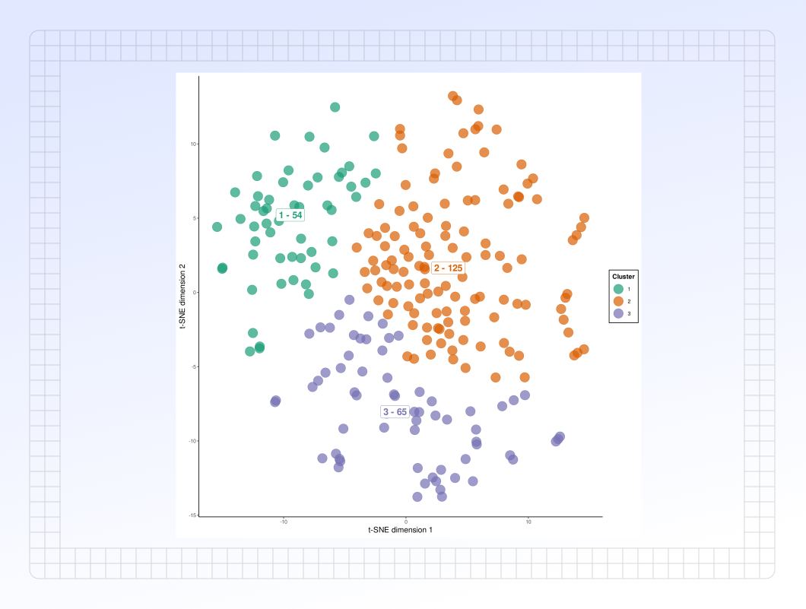

# Clustered t-SNE analysis

### Overview

The **Clustered t-SNE Analysis** view offers enhanced visualization and trend identification by applying clustering methods to the t-SNE plot.

<figure><figcaption></figcaption></figure>



The **Clusters** sub-tab allows the user to view clusters in the t-SNE plot that were identified by the selected clustering algorithm. A silhouette score is also provided to assess how defined each cluster is; the silhouette score value ranges from -1 to +1, where a high value indicates that the object is well matched to its own cluster and poorly matched to neighboring clusters.

This plot can be downloaded as SVG files or right-clicked and saved as a PNG in PANDORA.

<figure><figcaption></figcaption></figure>



The **Features** sub-tab allows the user to visually compare the mean values of features for each cluster. The color on the graph associated with each feature is provided in the legend.

This plot can be downloaded as SVG files or right-clicked and saved as a PNG in PANDORA.

<figure><figcaption></figcaption></figure>



The **FoldChange** sub-tab allows users to observe and compare fold changes in features across clusters.

This plot can be downloaded as SVG files or right-clicked and saved as a PNG in PANDORA.

<figure><figcaption></figcaption></figure>


