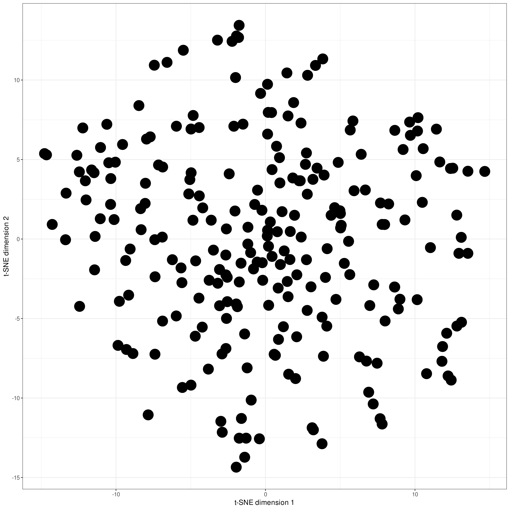
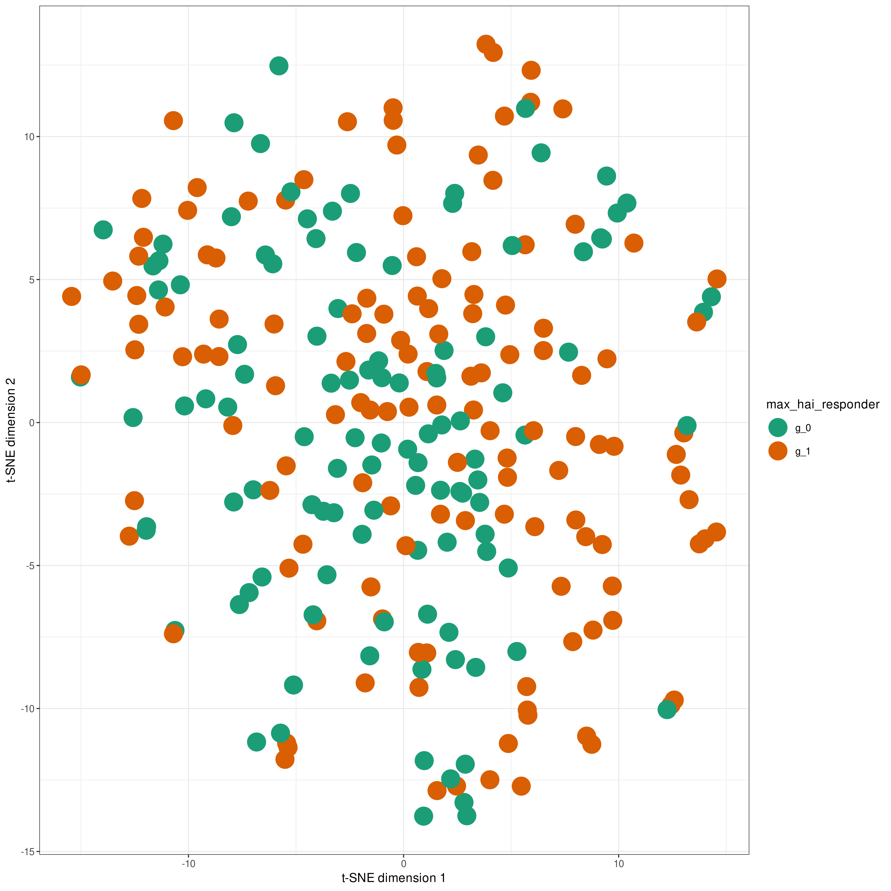
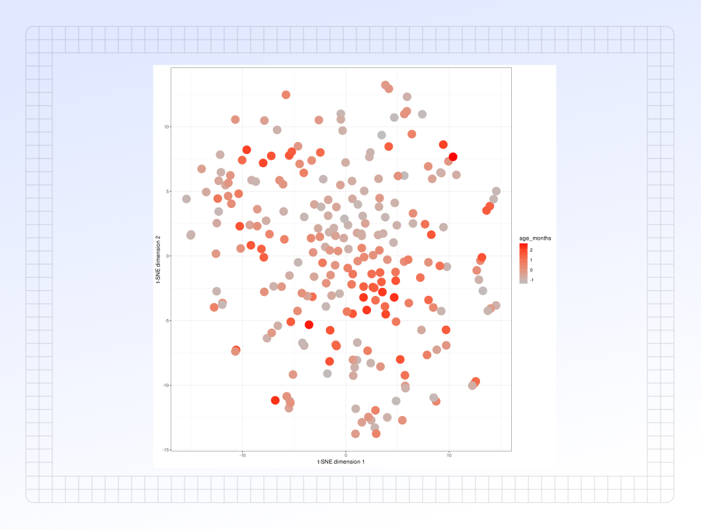

# t-SNE plot(s)

This tab displays the core t-SNE visualization results. You'll find the main t-SNE plot along with additional versions if you specified **Grouping** or **Coloring** variables during setup. These plots help you visualize potential clusters and see how known sample characteristics map onto the t-SNE embedding.

<figure><figcaption></figcaption></figure>

Available Plots in this Tab

1. **Main Plot:** (See label 1 in the screenshot, often selected via a menu 2)
   * This is the standard t-SNE plot showing the 2D embedding of all your samples. Points are typically displayed with a default color (e.g., black) or potentially colored by density if no other options are chosen.
   * Use this plot to get an initial sense of the overall structure and potential clusters in your data.
2. **Plots Colored by Variables:** (See plots under label 3)
   * **If you selected a Grouping Variable (categorical):** A version of the t-SNE plot where points are colored according to the categories in that variable (e.g., different colors for 'control' vs. 'treated'). This helps visualize if samples from the same predefined group cluster together in the t-SNE map.
   * **If you selected a Color Variable (continuous):** A version of the t-SNE plot where points are colored based on the value of that continuous variable (e.g., expression level of a gene, age). This helps visualize if the variable shows a gradient or pattern across the t-SNE map.



The **main plot** is generated from t-SNE analysis that excludes the selected grouping variables. This graph simply shows the low-dimensional location of each data point (or individual) without any overlay of grouping or colored variables.&#x20;

This plot can be downloaded as SVG files or right-clicked and saved as a PNG in PANDORA.

<figure><figcaption></figcaption></figure>



A **grouping plot** is generated for every selected grouping variable. Click on a grouping variable listed on the right side tabs to view its associated grouping t-SNE plot. The base analysis is the same as the main plot; the only difference is that now each outcome class is colored and overlaid on the plot for each individual.

These plots can be downloaded as SVG files or right-clicked and saved as a PNG in PANDORA.

<figure><figcaption></figcaption></figure>



A **colored plot** is generated for every selected color variable. Click on a color variable listed on the left side tabs to view its associated colored t-SNE plot. The base analysis is the same as the main plot; the only difference is that now each dot is colored (in a gradient) based on the value associated with the color variable.

These plots can be downloaded as SVG files or right-clicked and saved as a PNG in PANDORA.

<figure><figcaption></figcaption></figure>



#### Analysis Goal

By examining these plots, you can:

* Identify potential clusters or groups of similar samples based on their proximity in the 2D map.
* Investigate whether known sample attributes (Grouping Variable) align with the structures revealed by t-SNE.
* Explore correlations between continuous variables (Color Variable) and the sample distribution in the t-SNE embedding.
