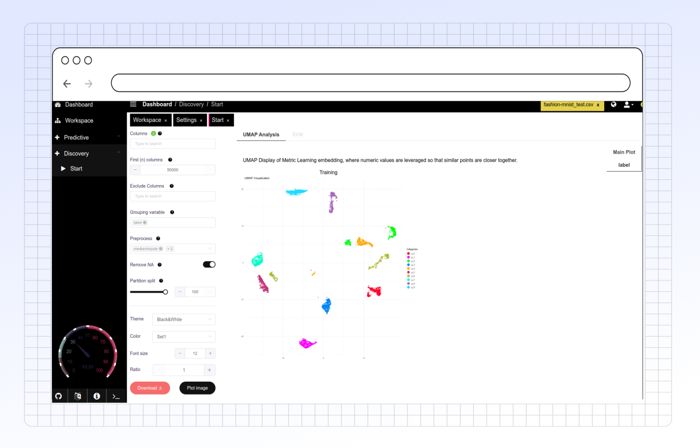

# UMAP

### Overview

<figure><figcaption></figcaption></figure>

### Key Functionalities

#### 1. Column Selection

* **Columns**: Select the columns you want to include in the UMAP analysis. Leaving this field empty will include all columns except those specified in "Exclude Columns."
* **First (n) Columns**: If no columns are selected, you can specify the number of columns to analyze here, ranging from 2 to 50,000.
* **Exclude Columns**: Choose any columns that you do not want to include in the UMAP analysis.

#### 2. Grouping and Preprocessing Options

* **Grouping Variable**: Select a categorical variable to group data points by color on the UMAP plot. This grouping variable will be excluded from the analysis but used in visualization.
* **Preprocess**: Select preprocessing options such as "medianImpute," "center," and "scale" to clean and prepare your data for UMAP.
* **Remove NA**: Enable this option to drop rows with missing values before processing.
* **Partition Split**: Set the train-test split ratio for supervised learning tasks. The split will be based on the grouping variable’s distribution.

#### 4. Plot and Download Options

* **Download Plot**: Save the UMAP plot as an SVG file for further analysis or reporting.
* **Plot Image**: Generate the UMAP plot based on the selected settings and display it on the screen.

### Additional Functionalities

* **Auto UMAP Settings**: Automatically adjusts UMAP settings based on data characteristics to optimize the visualization.
* **Training and Testing Splits**: Enables viewing the UMAP projections for training and testing splits if performing supervised learning.

