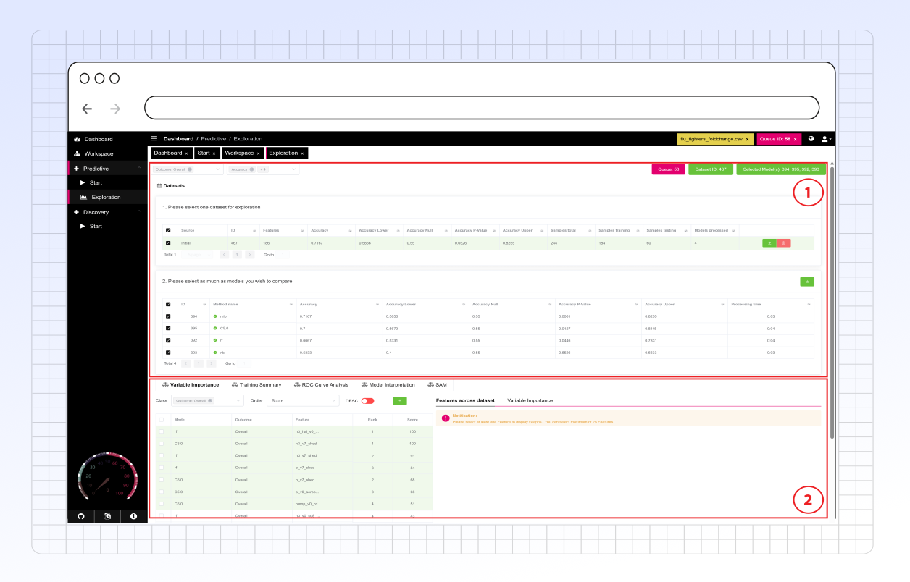

# Exploration

<figure><figcaption>
Main overview
</figcaption></figure>



There are several options for configuring the data to prepare it for exploring the results of the predictive models:&#x20;

* **Metric Selection:** Choose from a variety of metrics to display for your dataset. Metrics available will change depending on the associated outcomes selected.
* **Dataset Selection:** Select the dataset of interest to explore the results of its associated machine learning models.
  * Users can also download .csv files for each resampled data, training data, and testing data.
* **Model Selection:** Select machine learning models from the dataset to explore and compare results.
  * Users can also download the Rdata for each selected model at this step.



PANDORA provides a variety of tools to analyze the results of your predictive models along with its performance:&#x20;

* [**Variable Importance**](variable-importance.md)**:** Allows for assessment of feature contributions to model variance and visualization of feature value distribution for each outcome. This can reveal the top contributing features in the model for further investigation.
* [**Training Summary:**](training-summary.md) Provides whiskerplot comparison of training performance metrics between the selected models.
* [**ROC Curve Analysis:**](roc-curve-analysis.md) Provides a graphical representation for evaluating binary classification performance in models from both training and testing.
* [**Model Interpretation:**](model-interpretation-xai.md) Allows for investigation of feature impact on model performance through a variety of analysis options.



## Model Metrics

When PANDORA builds a machine learning model, it provides a set of metrics to help you evaluate its performance. Understanding these metrics is crucial for knowing how well your model is working and whether it's suitable for your research questions in systems vaccinology and immunology.

**The Golden Rule: Train vs. Test Performance**

You'll notice many metrics have a `Train...` prefix (e.g., `TrainAccuracy`) and a version without it (e.g., `Accuracy`).

* **`Train...` Metrics**: Performance on the data the model was _trained_ on.
* **Non-`Train...` Metrics (Test/Validation Metrics)**: Performance on _new, unseen_ data. **These are the most important for judging real-world performance!**
  * **Ideal Scenario**: High `Train...` scores AND high non-`Train...` scores, with both sets of scores being similar. This means your model has learned well and generalizes to new data.
  * **Overfitting**: High `Train...` scores but much lower non-`Train...` scores. The model learned the training data too well (including its noise) and won't perform well on new samples.
  * **Underfitting**: Low scores on both `Train...` and non-`Train...` metrics. The model is too simple and hasn't learned the underlying patterns.
  * **`TrainMean_...` Metrics**: These are typically averages from cross-validation during training. They give a more robust estimate of training performance than a single train run.

***

### I. Core metrics for classification

These metrics often depend on a chosen probability threshold (usually 0.5) to decide the predicted class. They are derived from a "confusion matrix" which counts:

* **True Positives (TP)**: Correctly predicted positive (e.g., correctly identified as "Responder").
* **True Negatives (TN)**: Correctly predicted negative (e.g., correctly identified as "Non-Responder").
* **False Positives (FP)**: Incorrectly predicted positive (e.g., "Non-Responder" mistakenly called "Responder").
* **False Negatives (FN)**: Incorrectly predicted negative (e.g., "Responder" mistakenly called "Non-Responder").

| Metric Name(s)                                                                                                                                                                                             | What it Measures (Simpler Terms)                                                                   | Range  | Ideal  | Key Question Answered                                                                    | Good For/Cautions                                                                                               |
| ---------------------------------------------------------------------------------------------------------------------------------------------------------------------------------------------------------- | -------------------------------------------------------------------------------------------------- | ------ | ------ | ---------------------------------------------------------------------------------------- | --------------------------------------------------------------------------------------------------------------- |
| 
<strong>Accuracy</strong> (<code>TrainAccuracy</code>)
                                                                                                                                           | Overall, what proportion of predictions were correct?                                              | 0 to 1 | Higher | "How often is the model right?"                                                          | Can be misleading if your classes are imbalanced (e.g., 90% Non-Responders, 10% Responders).                    |
| 
<strong>Balanced Accuracy</strong> (<code>TrainBalanced_Accuracy</code>, <code>TrainMean_Balanced_Accuracy</code>)
                                                                               | Average accuracy for each class.                                                                   | 0 to 1 | Higher | "How well does the model perform on average for each group?"                             | **Much better for imbalanced datasets than regular Accuracy.** A score of 0.5 is like random guessing.          |
| 
<strong>Precision</strong> / <strong>Positive Predictive Value (PPV)</strong> (<code>TrainPrecision</code>, <code>TrainMean_Precision</code>, <code>TrainPos_Pred_Value</code>)
                  | When the model predicts "positive" (e.g., "Responder"), how often is it correct?                   | 0 to 1 | Higher | "Of those predicted as 'Responder', how many actually were?"                             | Important when the cost of a False Positive is high (e.g., wrongly starting an expensive follow-up).            |
| 
<strong>Recall</strong> / <strong>Sensitivity</strong> / <strong>True Positive Rate (TPR)</strong> (<code>TrainRecall</code>, <code>TrainMean_Recall</code>, <code>TrainMean_Sensitivity</code>)
 | Of all the actual "positives", how many did the model correctly identify?                          | 0 to 1 | Higher | "Of all actual 'Responders', how many did we find?"                                      | Crucial when missing a positive is bad (e.g., failing to identify individuals who will benefit from a vaccine). |
| 
<strong>F1-Score</strong> (<code>TrainF1</code>, <code>TrainMean_F1</code>)
                                                                                                                      | A balance between Precision and Recall.                                                            | 0 to 1 | Higher | "How good is the model considering both finding positives and being right when it does?" | Useful when you care about both Precision and Recall, especially with imbalanced classes.                       |
| 
<strong>Specificity</strong> / <strong>True Negative Rate (TNR)</strong> (<code>TrainSpecificity</code>, <code>TrainMean_Specificity</code>)
                                                     | Of all the actual "negatives" (e.g., "Non-Responders"), how many did the model correctly identify? | 0 to 1 | Higher | "Of all actual 'Non-Responders', how many did we correctly identify?"                    | Important when correctly identifying negatives is key.                                                          |
| 
<strong>Negative Predictive Value (NPV)</strong> (<code>TrainNeg_Pred_Value</code>)
                                                                                                              | When the model predicts "negative", how often is it correct?                                       | 0 to 1 | Higher | "Of those predicted as 'Non-Responder', how many actually were?"                         | Complements PPV.                                                                                                |
| **Detection Rate**                                                                                                                                                                                         | Proportion of the _entire dataset_ that are true positives.                                        | 0 to 1 | Higher | "What fraction of all samples were correctly identified as positive?"                    | Influenced by how common the positive class is.                                                                 |

***

### II. Threshold-independent metrics

These metrics evaluate the model's ability to discriminate between classes across _all possible_ classification thresholds, rather than just one.

| Metric Name(s)                                                                            | What it Measures (Simpler Terms)                                                                                                                                                                               | Range         | Ideal  | Key Question Answered                                                                                                                  | Good For/Cautions                                                                                                                                       |
| ----------------------------------------------------------------------------------------- | -------------------------------------------------------------------------------------------------------------------------------------------------------------------------------------------------------------- | ------------- | ------ | -------------------------------------------------------------------------------------------------------------------------------------- | ------------------------------------------------------------------------------------------------------------------------------------------------------- |
| 
<strong>AUC / ROC AUC</strong> (<code>PredictAUC</code>, <code>TrainAUC</code>)
 | **Area Under the Receiver Operating Characteristic Curve.** The ROC curve plots Recall (Sensitivity) vs. (1 - Specificity) at all thresholds. AUC measures the model's ability to distinguish between classes. | 0.5 to 1      | Higher | "How well can the model tell the difference between a 'Responder' and a 'Non-Responder' across all possible cutoff points?"            | 0.5 = random guessing, 1.0 = perfect separation. A good general measure of discriminative power.                                                        |
| 
<strong>prAUC / AUPRC</strong> (<code>TrainprAUC</code>)
                        | **Area Under the Precision-Recall Curve.** This curve plots Precision vs. Recall at all thresholds.                                                                                                            | Baseline to 1 | Higher | "How well can the model achieve high precision (correct positive predictions) and high recall (finding all positives) simultaneously?" | **More informative than ROC AUC for highly imbalanced datasets** where the positive class is rare. Baseline is the proportion of positives in the data. |

***

### III. Other useful metrics

| Metric Name(s)                                                 | What it Measures (Simpler Terms)                                                                                                                                 | Range          | Ideal  | Key Question Answered                                                      | Good For/Cautions                                                                                                   |
| -------------------------------------------------------------- | ---------------------------------------------------------------------------------------------------------------------------------------------------------------- | -------------- | ------ | -------------------------------------------------------------------------- | ------------------------------------------------------------------------------------------------------------------- |
| **Kappa** (Cohen's Kappa)                                      | How much better the model's predictions are compared to random chance, accounting for class imbalance.                                                           | Approx -1 to 1 | Higher | "How much better is the model than just guessing randomly?"                | Good for imbalanced classes. 0 = like random chance, >0.6 is often considered substantial agreement.                |
| 
<strong>LogLoss</strong> (<code>TrainlogLoss</code>)
 | **Logarithmic Loss.** Measures how far off the model's _predicted probabilities_ are from the actual outcomes. It heavily penalizes confident wrong predictions. | 0 to ∞         | Lower  | "How well do the model's predicted probabilities match the true outcomes?" | Directly optimized by many models (like logistic regression). Good for evaluating the calibration of probabilities. |

***

### How to know if your model is "Good"?

There's no single magic number. Here's how to think about it:

1. **Define "Good" for YOUR Research Question:**
   * In vaccinology, is it more critical to find _all_ potential responders, even if you misclassify some non-responders (**prioritize Recall/Sensitivity**)?
   * Or is it more important that when you _claim_ someone is a responder, you are very likely correct, even if you miss some (**prioritize Precision**)?
   * Are your groups (e.g., responders vs. non-responders) imbalanced in size? If yes, **Accuracy is misleading!** Focus on `BalancedAccuracy`, `F1-Score`, `prAUC`, `Kappa`, and `Recall`/`Specificity` for each class.
2. **Look at the Test/Validation Metrics (non-`Train...`)**: These tell you how your model will likely perform on new, unseen individuals.
3. **Compare to a Baseline**: How would a very simple model perform (e.g., always predicting the majority class, or random guessing)? Your PANDORA model should be significantly better.
4. **Don't Rely on a Single Metric**: Look at a collection of relevant metrics. A model might have high `Accuracy` but terrible `Recall` for a rare but important group.
5. **Consider the Trade-offs**: Often, improving `Precision` can lower `Recall`, and vice-versa. The `AUC` metrics help evaluate performance independent of picking a specific threshold, while metrics like `F1-Score` try to balance this trade-off.
6. **Iterate and Refine**: Use these metrics to guide further model improvements, feature selection, or even how you define your groups.

By understanding these metrics, you can better interpret the models PANDORA generates and draw more confident conclusions for your systems vaccinology and immunology research.

