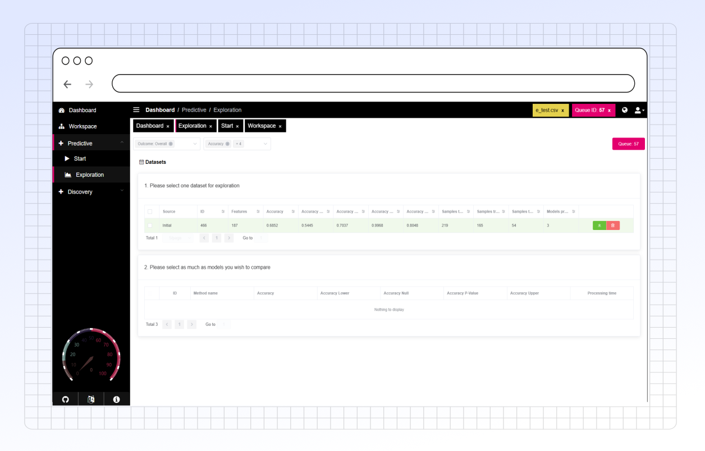

# Exploration

<figure><figcaption></figcaption></figure>

## Key Functionalities

### 1. Dataset Configuration

* **Metric Selection:** Choose from a variety of metrics to display for your dataset. Metrics available will change depending on the associated outcomes selected.
* **Dataset Selection:** Select the dataset of interest to explore the results of its associated machine learning models
* **Model Selection:** Select machine learning models from the dataset to explore and compare results

### 2. Analysis Options

* [**Variable Importance**](variable-importance.md)**:** Allows for assessment of feature contributions to model variance and visualization of feature value distribution for each outcome. This can reveal the top contributing features in the model for further analysis.
* [**Training Summary:**](training-summary.md) Provides whiskerplot comparison of training performance metrics between the selected models&#x20;
* [**ROC Curve Analysis:**](roc-curve-analysis.md) Provides a graphical representation for evaluating binary classification performance in models from both training and testing
* [**Model Interpretation:**](model-interpretation.md) Allows for investigation of feature impact on model performance through a variety of analysis options.

## Conclusion

The **Predictive - Exploration** tab provides a comprehensive suite of analytical tools to assess performance of machine learning models. It supports users in comparing models and investigating features to develop actionable insights.
