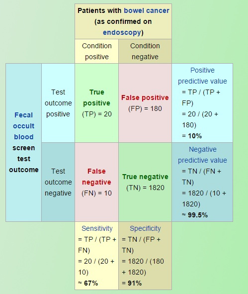

# Sensitivity, specificity, and predictive values: what do they mean?

So, you've built a predictive model in PANDORA, and you're looking at a bunch of metrics. Terms like Sensitivity, Specificity, PPV, and NPV can sound a bit intense, but they're actually super useful for understanding how well your model is performing, especially for classification tasks. Let's break them down in plain English.

<figure><figcaption></figcaption></figure>

#### What's Sensitivity (aka True Positive Rate)?

Alright, let's talk Sensitivity, often called the True Positive Rate (TPR). Imagine your PANDORA model is trying to predict if someone is a 'responder' to a vaccine (the 'positive' class).

**Sensitivity tells you: Of all the people who&#x20;**_**truly are**_**&#x20;responders, what proportion did your model correctly flag as responders?**

A super sensitive model is a champ at finding the actual positives. If a model were 100% sensitive (which is pretty rare!), it would catch every single true responder. A model with 90% sensitivity? It correctly identifies 90% of the true responders but, whoops, misses the other 10%.

**Why care?** A highly sensitive test or model is your go-to for _ruling out_ something if the result is negative. Think of it like this: if a very sensitive test for a condition comes back negative, you can be pretty confident the person _doesn't_ have it.

There's a handy acronym: **SnNout** (High **S**e**n**sitivity, **N**egative result = rule **out**).

#### And What About Specificity (aka True Negative Rate)?

Next up is Specificity, or the True Negative Rate (TNR). This is like the flip side of sensitivity.

**Specificity asks: Of all the people who truly&#x20;**_**are not**_**&#x20;responders (the true negatives), what proportion did your model correctly label as non-responders?**

A highly specific model is fantastic at correctly identifying those who _don't_ have the condition or aren't in the positive class. If your model boasts 100% specificity, it perfectly identifies every single true negative. With 90% specificity, it correctly spots 90% of the true negatives.

**When is this golden?** Highly specific tests are brilliant for _ruling in_ a condition when the result is positive. If a very specific test says "yes," you can be more confident it's a true "yes."

Another cool acronym for this one: **SPin** (High **Sp**ecificity, **P**ositive result = rule **in**).

#### Seeing Sensitivity and Specificity in Action

It's often a balancing act between sensitivity and specificity. What's considered "high" for these metrics can really depend on the context of your PANDORA model and the specific problem you're tackling.

**Example: High Sensitivity, Lower Specificity (like a Mammogram)**
\
Think about mammograms. They're designed to be highly sensitive (often around 70-80%, though it varies) to catch as many potential cases of breast cancer as possible. That's great for not missing cases!

But, this often means they have lower specificity. They might flag things that aren't actually cancer, leading to false positives. In fact, Cancer.gov mentions that many women getting regular mammograms will experience a false positive at some point. So, while great for catching potential issues (high sensitivity), they might also raise a few unnecessary alarms (lower specificity).

**Example: Lower Sensitivity, High Specificity (like some quick diagnostic tests)**
\
On the flip side, some tests might have lower sensitivity but high specificity. For instance, a quick nitrate dipstick test for UTIs in hospitals might be around 27% sensitive (meaning it misses a lot of actual UTIs) but 94% specific (meaning if it _does_ say UTI, it's pretty likely correct).

When you're looking at your PANDORA models, think about this trade-off. Do you need to catch every possible positive, even if it means more false alarms? Or is it more critical to be absolutely sure when you call something positive, even if you miss a few?

#### Let's Talk Positive Predictive Value (PPV)

Okay, so your PANDORA model flags a sample as "positive." What now? That's where Positive Predictive Value (PPV) steps in.

**PPV tells you: If your model predicts a sample is positive, what's the probability that it&#x20;**_**actually is**_**&#x20;positive?**

This is super important. Just because a model says "positive" doesn't automatically mean it's 100% true. For example, if a cancer test has a PPV of 15.2%, a positive result means there's a 15.2% chance of actually having cancer. So, a positive result is a flag, but PPV gives you the odds it's a _correct_ flag.

PPV, along with sensitivity, specificity, and NPV (we'll get to that!), is a key piece in judging how well your screening model is doing.

One big thing to remember about PPV: **it's heavily influenced by how common the condition (or positive class) is in your dataset (this is called prevalence).**

* If the condition is very common, a positive test result is more likely to be a true positive.
* If the condition is rare, a positive test result has a higher chance of being a false alarm, even with a decent test.

**How Do You Calculate PPV?**

You've got a couple of common ways to crunch the numbers for PPV:

**Formula 1 (using counts):**
`PPV = True Positives / (True Positives + False Positives)`

Basically, out of all the times your model shouted "Positive!", how many times was it right?

**Formula 2 (using sensitivity, specificity, and prevalence):**
`PPV = (Sensitivity * Prevalence) / [(Sensitivity * Prevalence) + ((1 - Specificity) * (1 - Prevalence))]`

(Remember, Prevalence is how common the positive class is in your data.)

**Using a 2x2 Contingency Table**

These tables are your friend for these kinds of metrics! Imagine a table like this (where 'a', 'b', 'c', 'd' are counts of your model's predictions against the true values):

|                        | Actually Positive | Actually Negative |
| ---------------------- | :---------------: | :---------------: |
| **Predicted Positive** |         a         |         b         |
|                        |  (True Positive)  |  (False Positive) |
| **Predicted Negative** |         c         |         d         |
|                        |  (False Negative) |  (True Negative)  |

For PPV, you're interested in cell 'a' (True Positives) and cell 'b' (False Positives).

So, `PPV = a / (a + b)`

Let's say:

* True Positives (a) = 99
* False Positives (b) = 901

Then, `PPV = 99 / (99 + 901) = 99 / 1000 = 0.099`.
\
This means if this model predicts positive, there's a 9.9% chance it's actually positive. (Or, you could say 9.9 out of 100 such positive predictions would be correct).

A good model aims to have low numbers for false positives (b) and false negatives (c). Perfect models are rare, though! And remember, prevalence plays a big role in PPV.

**PPV vs. Sensitivity: What's the Diff?**

It's easy to mix up PPV and Sensitivity, but they tell you different things:

* **Sensitivity:** Is about the model's ability to _find_ all the true positives _among those who are actually positive_. (How many of the 'responder' individuals did our model correctly identify?) This helps you evaluate the _model itself_.
* **PPV:** Is about the probability that a _positive prediction from your model is actually true_. (If the model says this sample is a 'responder', what are the chances it really is?) This is super relevant when you're interpreting a specific positive result from your model.

Think of it this way: Sensitivity helps you pick a good "net" for fishing (how good is the net at catching the target fish?), while PPV tells you, if you caught something, what's the chance it's actually the fish you were looking for (and not an old boot!). Both are important perspectives when looking at your PANDORA model's results.

#### And Finally, Negative Predictive Value (NPV)

Last but not least, let's look at the Negative Predictive Value (NPV). This is the counterpart to PPV.

**NPV asks: If your model predicts a sample is negative, what's the probability that it&#x20;**_**actually is**_**&#x20;negative?**

So, it's about how much you can trust a "negative" prediction from your model.

**How to Calculate NPV?**

Using our trusty 2x2 contingency table again:

|                        | Actually Positive | Actually Negative |
| ---------------------- | :---------------: | :---------------: |
| **Predicted Positive** |         a         |         b         |
|                        |  (True Positive)  |  (False Positive) |
| **Predicted Negative** |         c         |         d         |
|                        |  (False Negative) |  (True Negative)  |

The formula is:
`NPV = True Negatives / (True Negatives + False Negatives)`
\
Or, using the table cells:
`NPV = d / (c + d)`

Let's say from a dataset:

* False Negatives (c) = 32
* True Negatives (d) = 43123

Then, `NPV = 43123 / (32 + 43123) = 43123 / 43155 = 0.9992...` (which is about 99.9%).
\
This would mean if this particular model predicts negative, there's a 99.9% chance the sample truly is negative. That's pretty reassuring for a negative result!

Just like PPV, NPV is also influenced by the prevalence of the condition in your data. With very rare conditions, NPV tends to be high (because most negative predictions will indeed be true negatives).
