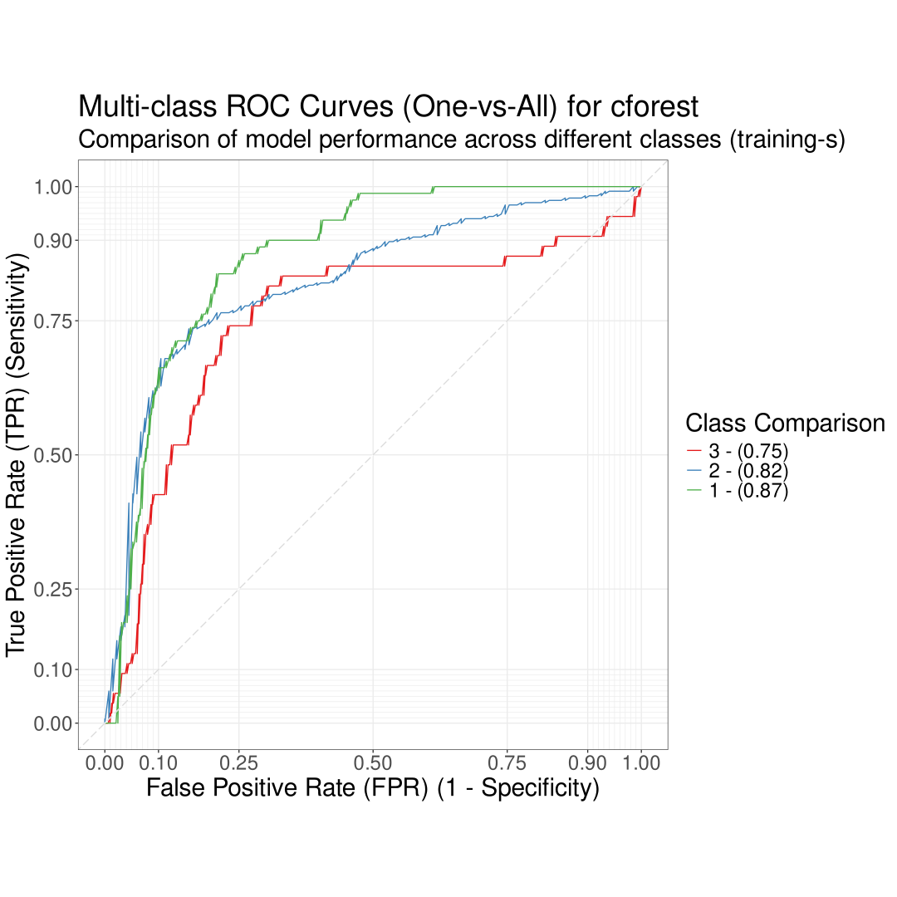
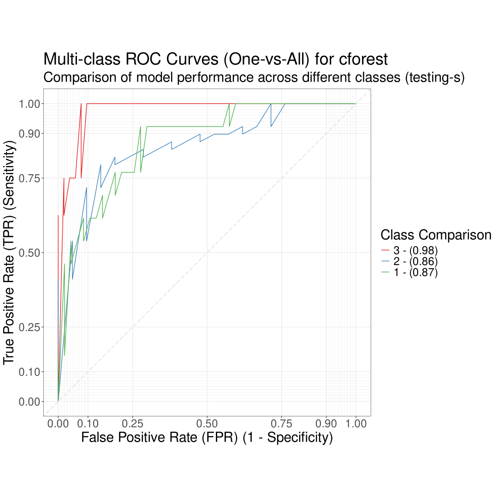

# ROC Curve Analysis

### Overview

The **ROC Curve Analysis** tab in PANDORA provides a clear interface for visualizing the classification performance of predictive models. Its intuitive design allows users to easily compare individual or multiple models at once, and provides comprehensive customization options for ROC Curve visualization.

<figure><figcaption></figcaption></figure>



The **ROC curves** provide a graphical representation of the trade-off between true positive and false positive rates. ROC curves provide valuable insights into model performance and can be helpful when comparing models. A good ROC curve is one that curves close to the top-left corner, indicating a balance of sensitivity and specificity.

* **Training ROC curve:** Shows the model's ability to correctly classify outcomes within the training dataset.

<figure><figcaption></figcaption></figure>

* **Testing ROC curve:** Demonstrates the model's performance on correctly classifying outcomes with the unseen testing dataset.

<figure><figcaption></figcaption></figure>



Users can select the model to display the ROC curve for in both training and testing, and can choose to display an ROC curve for all or one model at a time.

* **One-vs-All:** This display setting allows users to select one model to display an ROC curve for at a time, and a curve will be provided for all classification outcomes.
  * Select the model to display by clicking the tab for the desired model located directly above the ROC curve.

<figure><figcaption></figcaption></figure>

* **Comparison**: This display setting allows users to view ROC curves of all selected models on one graph.

<figure><figcaption></figcaption></figure>



