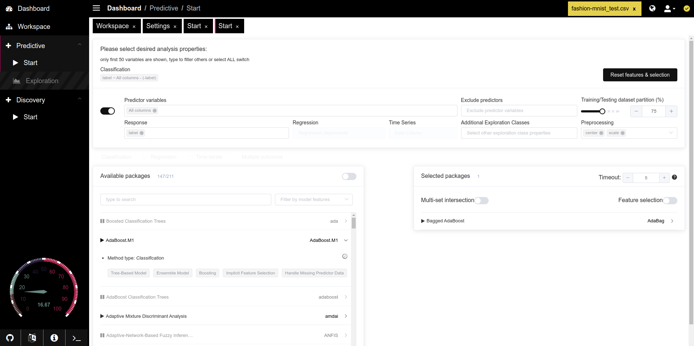

# Machine Learning

<figure><figcaption></figcaption></figure>

### Key Functionalities

#### 1. Analysis Properties

* **Classification / Regression / Time Series**: Choose the type of analysis you want to perform. Only available options are displayed based on your dataset and selected variables.
* **Predictor Variables**: Select the independent variables (predictors) for the model. Enable the switch to select all columns, or specify individual columns by typing their names.
* **Response**: Define the dependent variable (response) that the model will predict or classify.
* **Exclude Predictors**: Specify any predictor variables that should be excluded from the analysis.
* **Training/Testing Dataset Partition (%)**: Adjust the partition between training and testing datasets using a slider (default: 75%). This enables you to set the ratio for model validation.
* **Additional Exploration Classes**: Add exploratory variables that are not used in the model training but are available for analysis.
* **Preprocessing**: Apply preprocessing methods such as centering or scaling to standardize data before training the model. You can select multiple options from the dropdown menu.

#### 2. Model Selection and Customization

* **Available Packages**: Choose from a variety of machine learning models available in SIMON. Each model displays its name, type (classification, regression, etc.), and key characteristics.
  * **AdaBoost.M1**: An example of a model available under **Boosted Classification Trees**, with tags like Tree-Based Model, Ensemble Model, Boosting, and more.
* **Model Filtering**: Filter models by type or features to narrow down the list of packages.
* **Selected Packages**: Displays the list of selected models for analysis. You can choose multiple models for comparison and evaluation.

#### 3. Advanced Options

* **Multi-Set Intersection**: Enable this option to intersect multiple sets in a Venn-like manner, useful for combining features from different models.
* **Feature Selection**: Enable feature selection to automatically reduce dimensionality and retain only the most relevant features for the model.
* **Timeout**: Set a timeout (in minutes) to limit the execution time for model training, preventing lengthy computations.

#### 4. Additional Controls

* **Reset Features & Selection**: Clears all selected features, models, and settings, allowing you to start with a fresh configuration.

### Example Workflow

1. **Select Analysis Properties**: Choose your predictor and response variables, configure preprocessing, and set the training/testing split.
2. **Choose Models**: Select one or more models from the **Available Packages** list and add them to **Selected Packages**.
3. **Run Analysis**: Configure advanced options like feature selection and multi-set intersection as needed, then initiate the analysis.

The **Predictive - Start** tab in SIMON simplifies the process of setting up and running predictive models, making it accessible to users with various levels of expertise. Its intuitive interface and extensive model selection provide flexibility for both exploratory and targeted predictive analysis.
