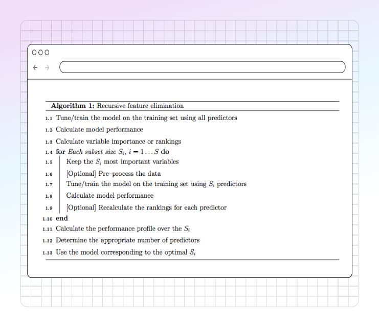

# Feature Selection

Feature selection is a critical preprocessing step in machine learning, aimed at identifying and retaining the most informative subset of predictors (features) from the original dataset for model training. Its objectives typically include improving model generalization performance, reducing computational complexity, mitigating the risk of overfitting (especially in high-dimensional datasets), and enhancing model interpretability. Within the PANDORA software, enabling the "Feature Selection" option initiates an automated procedure to determine an optimal feature subset prior to final model training.

<figure><figcaption></figcaption></figure>

PANDORA employs a methodology analogous to Recursive Feature Elimination (RFE) when the Feature Selection option is activated. The process can be formalized as follows:

1. **Initial Model Fit and Feature Ranking:** The selected machine learning algorithm is initially trained using the complete set of input predictors. Subsequently, a feature importance metric (intrinsic to the chosen algorithm, e.g., coefficient magnitude for linear models, Gini importance or permutation importance for tree-based ensembles) is computed for each predictor. Predictors are then ranked based on these importance scores in descending order.
2. **Iterative Subset Evaluation:** A predefined sequence of candidate subset sizes, denoted as S = {S1, S2, ..., Sk} where S1 > S2 > ... > Sk, is established. This sequence represents the number of top-ranked features to retain at each iteration.
3. **Model Refitting and Performance Assessment:** For each candidate size Si in the sequence S:
   * The subset comprising the top Si predictors (based on the ranking from Step 1, or potentially recalculated as discussed below) is selected.
   * The machine learning model is refit using only this reduced feature subset.
   * The performance of this refit model is evaluated using a chosen cross-validation strategy and performance metric (e.g., accuracy, AUC, RMSE).
4. **Optimal Subset Identification:** The performance metrics obtained for each candidate subset size Si are compared. The subset size S\_optimal that yields the best performance according to the selected metric is identified.
5. **Final Model Training:** The definitive model is trained using only the predictors corresponding to the optimal subset identified in Step 4 (S\_optimal features). This model represents the final output of the PANDORA process when Feature Selection is enabled.
