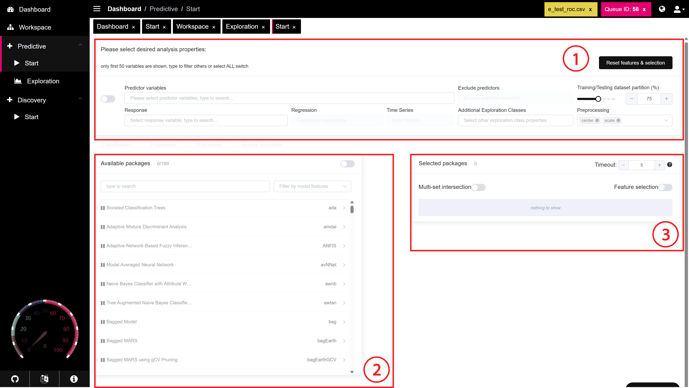
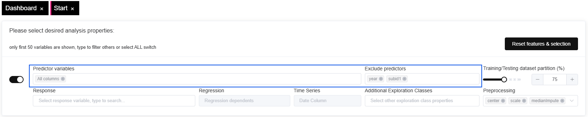
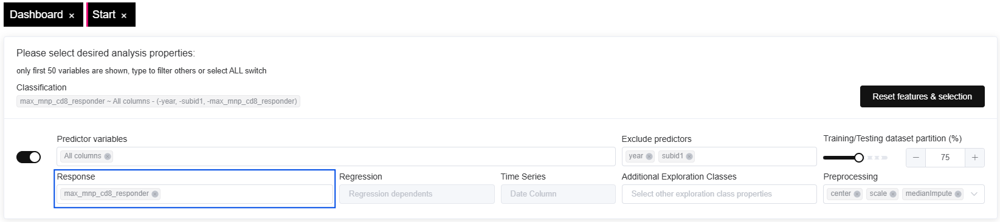
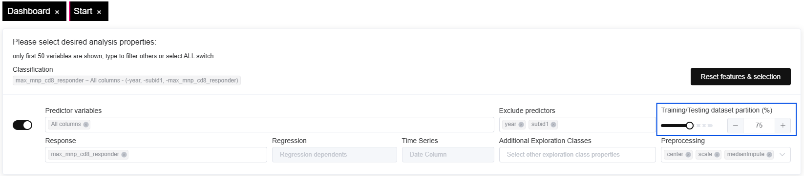
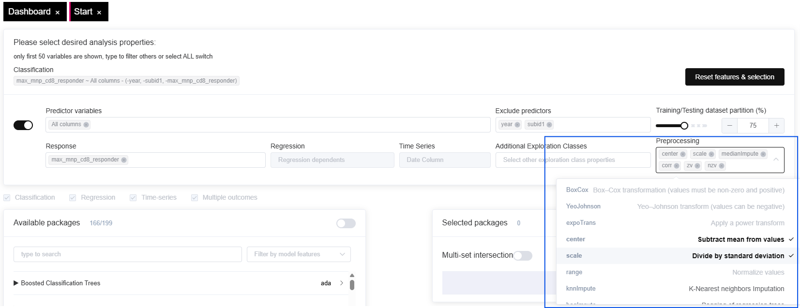

# SIMON

### Overview

The **Predictive - Start** tab in SIMON offers a simple way to set up and run predictive models.

<figure><figcaption></figcaption></figure>



In the analysis properties section, the user sets up their predictive model based on the dataset and its associated features. Setup options are provied below:

* **Classification / Regression / Time Series**: Choose the type of analysis you want to perform. Only available options are displayed based on your dataset and selected variables.
* **Predictor Variables**: Select the independent variables (predictors) for the model. Enable the switch to select all columns, or specify individual columns by typing their names.
* **Response**: Define the dependent variable (response) that the model will predict or classify.
* **Exclude Predictors**: Specify any predictor variables that should be excluded from the analysis.
* **Training/Testing Dataset Partition (%)**: Adjust the partition between training and testing datasets using a slider (default: 75%). This enables you to set the ratio for model validation.
* **Additional Exploration Classes**: Add exploratory variables that are not used in the model training but are available for analysis.
* **Preprocessing**: Apply preprocessing methods such as centering or scaling to standardize data before training the model. You can select multiple options from the dropdown menu.
* **Reset Features & Selection**: Clears all selected features, models, and settings, allowing you to start with a fresh configuration.



In the model selection and customization section, the user can select the predictive models to build for their dataset. Users can either select specific packages to run, or can filter and select all packages of a specific category.

* **Available Packages**: Choose from a variety of machine learning models available in SIMON. Each model displays its name, type (classification, regression, etc.), and key characteristics.
  * **AdaBoost.M1**: An example of a model available under **Boosted Classification Trees**, with tags like Tree-Based Model, Ensemble Model, Boosting, and more.
* **Model Filtering**: Filter models by type or features to narrow down the list of packages.
* **Selected Packages**: Displays the list of selected models for analysis. You can choose multiple models for comparison and evaluation.



SIMON offers advanced functionalities to streamline model development and optimization.

* [**Multi-Set Intersection**](multiset-intersection.md): Enable this option to intersect multiple sets in a Venn-like manner, useful for combining features from different models.
* [**Feature Selection**](feature-selection.md): Enable feature selection to automatically reduce dimensionality and retain only the most relevant features for the model.
* **Timeout**: Set a timeout (in minutes) to limit the execution time for model training, preventing lengthy computations.



### Example Workflow



Choose your predictor and response variables, configure preprocessing, and set the training/testing split.

* **Select Predictor variables:** In this case, all predictor variables are selected, and the "exclude predictors" is used to remove non-contributing features from the analysis, such as arbitrary sample ids.&#x20;

<figure><figcaption></figcaption></figure>

* **Select Response Variables**: Select the desired response variable. In a classification model, this is the outcome the model is trying to predict based on the predictor features.

<figure><figcaption></figcaption></figure>

* **Set Training/Testing Dataset partition**: Use the slider to adjust the partition between training and testing. In this case, we will keep the standard 75% partition, though it may make sense to vary the partition based on the machine learning package used.

<figure><figcaption></figcaption></figure>

* **Configure Preprocessing:** Select preprocessing methods to appropriately standardize data based on your dataset and the machine learning packages you plan to use.

<figure><figcaption></figcaption></figure>



* **Choose Models**: Select one or more models from the **Available Packages** list and add them to **Selected Packages**.
* **Run Analysis**: Configure advanced options like feature selection and multi-set intersection as needed, then initiate the analysis.


