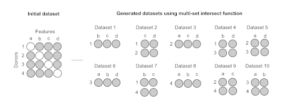

# mulset - multiset intersection

If you cannot impute your data for whatever reason you can enable **Multiset Intersection** option in SIMON. If enabled _**mulset**_ algorithm with find shared features where there is no missing values. Accordingly it will create multiple datasets with different number of subjects and features. That you can use in you machine learning analysis.

<figure><figcaption></figcaption></figure>

More about _**mulset**_ [here](https://cran.r-project.org/web/packages/mulset/index.html).
