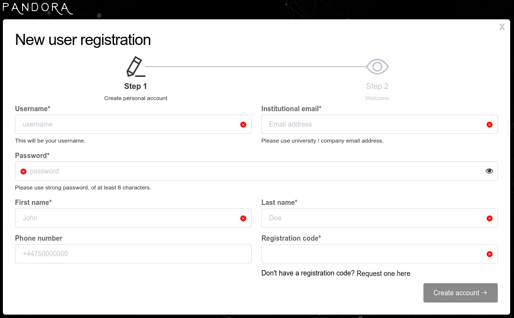

# Account Creation

After you installed PANDORA navigate to:

* [http://localhost:3010](http://localhost:3010) if you used default installation commands
* Your custom URL if configured

It could take up to 1 minute for system to boot-up.

Now, you will see main login screen where you can create  your account by clicking on "Sign up now"

<figure><figcaption></figcaption></figure>

You will be taken to the page below:&#x20;

<figure><figcaption></figcaption></figure>

Fill out the required information and your account is ready to use!&#x20;


You will need free registration key that you can obtain here:\
[https://pandora.atomic-lab.org/request-api-key/](https://pandora.atomic-lab.org/request-api-key/)\
(Your key is confidential, so please store it securely.)

