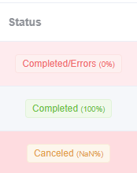

# Dashboard

Here you will see all your **Queue Tasks** for training predictive models through SIMON. One **Task** consists of all ML models and datasets you selected and created when [creating Task in SIMON](../data-analysis/predictive/#id-1.-simon-machine-learning). Here you can also observe the progression of the training and testing of your predictive models along with a summary of training results. **More importantly** you need **to select specific completed Task** to continue to [**Exploration**](../data-analysis/predictive/exploration/)**.**

<figure><figcaption></figcaption></figure>



The table on Dashboard consists of various information and operations related to the specific Queue Tasks (predictive model processes in progress and completed). Here are details for the information provided in the tables:&#x20;

**Name**: The user is able to change the name of the specific Queue Task

**Created**: Creation date and time (as per GMT time zone)

**Processing time**: Provides the time taken for the models to complete training and testing with the given dataset and samples

**Status**: Tells us current progress of specific task

<figure><figcaption></figcaption></figure>

**Extraction**: Is RFF(Backward Selection) being used?

**Sparsity**: Percentage of how sparse the given dataset is. Sparsity below 50% is preferred.

**Resamples:** how many different datasets are being created & tested in specific task. Especially if [mulset ](../data-analysis/predictive/simon/multiset-intersection.md)is used there can be a number of different datasets.

**Models processed**: Illustrates how far along has SIMON reached in training and testing the predictive models for the given dataset.

**Successful models**: The number of models that were successfully trained and tested out of all the models sent to SIMON for processing.&#x20;



<figure><figcaption></figcaption></figure>

The operations column consists of the following:&#x20;

* **More information**: View basic information, processing time and statistics for the successful models and resamples in specific Task.
  *   Example:

      <figure><figcaption></figcaption></figure>
* **Download queue**: Download the dataset from which predictor and response variables were chosen as a .csv file
* **Delete queue**



