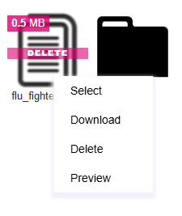
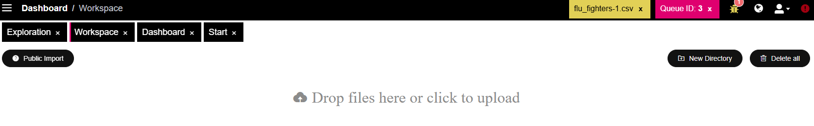
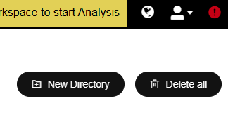
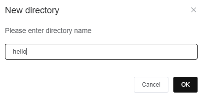
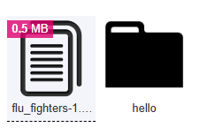

# Workspace

The Workspace is a space where the user is able to upload their datasets for analysis. This is also the space where any files saved to PANDORA (e.g. saving your cluster classifications with the dataset) will show up.


System currently supports only **.csv** files.


<figure><figcaption></figcaption></figure>



By right-clicking on a file, a panel is presented with various options for the file

<figure><figcaption></figcaption></figure>

* **Select**: Choose this file/dataset for using the [Discover ](../data-analysis/discovery/)and [SIMON](../data-analysis/predictive/simon/)
* **Download**
* **Delete**
* **Preview**: View the first 100 rows and 50 columns of the file on PANDORA



Upload files by dropping at the stated location or by clicking at that same location&#x20;

<figure><figcaption>
Location of file upload option
</figcaption></figure>



At the top right corner of the Workspace page, the **New Directory** and **Delete all** options reside:&#x20;

<figure><figcaption></figcaption></figure> <figure><figcaption></figcaption></figure> <figure><figcaption></figcaption></figure>

**Delete all**: Delete all the files present in the workspace.&#x20;


