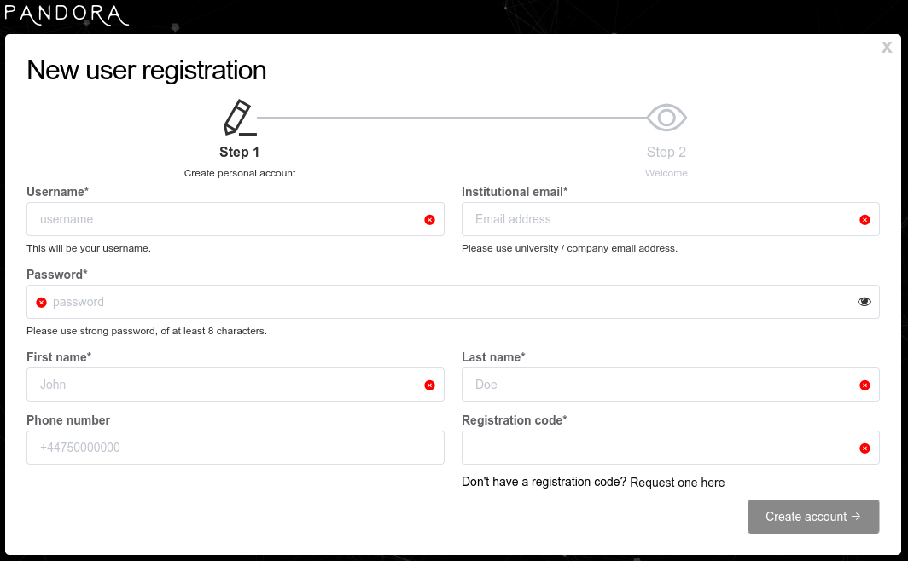

# Your PANDORA Account

Now that PANDORA is installed, learn how to register your account, rest password if needed, and user settings available upon logging into PANDORA.

<table data-view="cards"><thead><tr><th></th><th data-type="content-ref"></th><th data-hidden data-card-cover data-type="files"></th></tr></thead><tbody><tr><td><ol><li><strong>Create your account</strong></li></ol></td><td><a href="account-creation.md">account-creation.md</a></td><td><a href="../../.gitbook/assets/AdobeStock_468957430.jpeg">AdobeStock_468957430.jpeg</a></td></tr><tr><td><ol start="2"><li><strong>Reset password</strong></li></ol></td><td><a href="reset-password.md">reset-password.md</a></td><td><a href="../../.gitbook/assets/AdobeStock_534823040.jpeg">AdobeStock_534823040.jpeg</a></td></tr><tr><td><ol start="3"><li><strong>User settings</strong></li></ol></td><td><a href="user-settings.md">user-settings.md</a></td><td><a href="../../.gitbook/assets/AdobeStock_438582115.jpeg">AdobeStock_438582115.jpeg</a></td></tr></tbody></table>

* [http://localhost:3010](http://localhost:3010) if you used default installation commands
*

It could take up to **1 minute** for system to boot-up on first run.



Now, you will see main login screen where you can create  your account by clicking on **"Sign up now"**

<figure><figcaption>
Sign-in screen
</figcaption></figure>



[Register ](https://pandora.atomic-lab.org/request-api-key/)for registration key and fill out the required information and your account is ready to use.&#x20;

<figure><figcaption>
Registration screen
</figcaption></figure>




You will need free registration key that you can obtain here:\
[https://pandora.atomic-lab.org/request-api-key/](https://pandora.atomic-lab.org/request-api-key/)\
(Your key is confidential, so please store it securely.)

