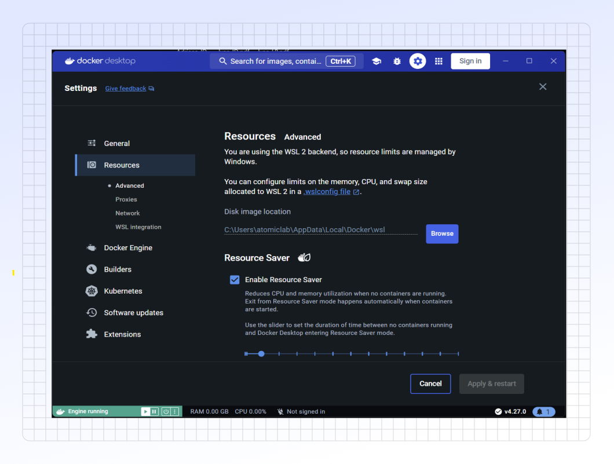

# Docker Configuration

### What is Docker?


Think of Docker as a way to package an application and all its necessities (like code, libraries, settings, and tools) into a single, neat box called a "container."


This container acts like a lightweight, isolated environment. The key benefit is that this container can then be run consistently on almost any computer that has Docker installed, regardless of the underlying operating system or configuration.


Essentially, it solves the classic problem of "it worked on my machine!" by ensuring the application runs the same way everywhere – from a developer's laptop to testing servers and finally to production.

### Configuration

PANDORA runs best when it has access to plenty of RAM and CPU power.

Please check your Docker Desktop settings (usually under "Settings" or "Preferences" > "Resources"). 

If needed, consider increasing the amount of memory (RAM) and the number of CPU cores allocated to Docker to improve PANDORA's performance.

Identify the backend your Docker setup uses, then refer to the corresponding option below.



<figure><figcaption>
Use these settings to allocate RAM and CPU resources to Docker. Allocate generously for optimal PANDORA performance, but ensure sufficient resources remain for your host operating system.
</figcaption></figure>



<figure><figcaption>
When using the WSL backend, resource limits might be managed via<a href="https://learn.microsoft.com/en-us/windows/wsl/wsl-config"> WSL's global configuration</a> (Outside Docker Desktop settings).
</figcaption></figure>



