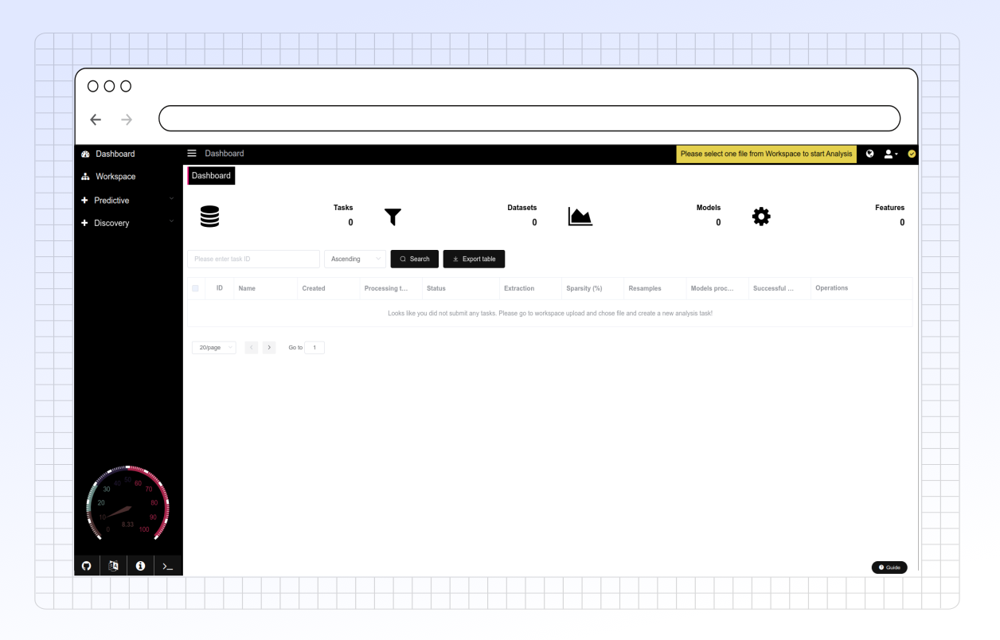

# Dashboard

The Dashboard is a space where you can observe the progression of the training and testing of your predictive models with various supervised machine learning algorithms. This space also allows you to download the resulting data and model obtained as a .Rdata file

Choosing one of the rows in the space gives you access to visualize and understand your data on PANDORA itself by going to the ‘Exploration’ tab under ‘Predictive’.&#x20;

<figure><figcaption></figcaption></figure>
