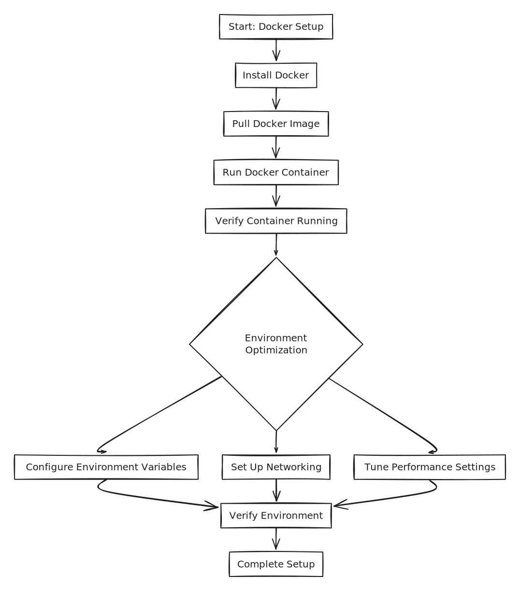

# Source code

## Source Code Structure

The PANDORA source code is organized into two main GitHub repositories:

* **Frontend:** [`genular/pandora`](https://github.com/genular/pandora)
  * Contains the user interface application.
  * Developed using the Vue.js framework.
* **Backend:** [`genular/pandora-backend`](https://github.com/genular/pandora-backend)
  * Houses the core backend logic.
  * Includes modules written in PHP, R, and Python to handle data processing, statistical analysis, and server-side operations.

This separation allows for independent development and deployment cycles for the UI and the core analysis engine. Both components are bundled together in the final Docker image during the build process.



## Running PANDORA Locally (Development Version)

This guide outlines the steps to set up and run PANDORA from its source code for development purposes. This setup allows for direct code modification and testing, differing from the Docker-based production installation.

### Prerequisites

Before you begin, ensure you have the following installed and configured on your system (preferably Linux, as the development environment is primarily tested on it):

**Core Tools:**

* **Git:** For cloning the repositories.
* **Node.js and Yarn:** For managing and building the frontend. (A recent Node.js version is recommended).
* **PHP (e.g., 8.2+):** For the main backend API.
* **Composer:** For PHP dependency management.
* **R (e.g., 4.x.x):** For the analysis and plots Plumber servers, and the CRON job.
* **Java Development Kit (JDK):** Required for R's Java integration (`R CMD javareconf`).
* **Python 3 & Pip:** `python3-pandas` is a specific requirement.
* **MySQL Compatible Database Server:** (e.g., MySQL or MariaDB).

**System Libraries (especially for R package compilation & cron):**

* Build essentials: `build-essential`
* `libssl-dev` (for OpenSSL)
* `libxml2-dev`
* `libcurl4-openssl-dev` (or similar, for RCurl/curl in R)
* `libssh2-1-dev`
* `libopenblas-dev` or other BLAS/LAPACK implementations (e.g., ATLAS, MKL)
* `libopencv-dev` (if OpenCV features are used by R packages)
* `gfortran`
* `mesa-common-dev`, `libglu1-mesa-dev`, `freeglut3-dev` (for R graphics packages)
* `librsvg2-bin` (for `rsvg-convert` if used by backend)

**Optional but Recommended for Development:**

* **PM2:** A process manager for Node.js, useful for managing the multiple backend R and PHP services (`yarn global add pm2`).
* **`flock`:** Utility to prevent multiple cron job instances from running simultaneously.

**GitHub Personal Access Token (PAT):**

* If `genular` R packages are hosted in private GitHub repositories, you will need a GitHub PAT with `repo` scope to install them. This token will be set as the `GITHUB_PAT` environment variable for R.

### 1. Clone Repositories

Clone the frontend and backend repositories. The script uses `/var/www/genular/`, but you can choose your preferred path (e.g., `/mnt/atomiclab/` or `~/projects/`). Be consistent with the path you choose.

```bash
# Example: Using /var/www/genular/ (ensure you have write permissions or use sudo appropriately)
sudo mkdir -p /var/www/genular
sudo chown $USER:$USER /var/www/genular # Or your user/group
cd /var/www/genular

# Clone the frontend repository
git clone --recursive https://github.com/genular/pandora.git
GIT_FRONTEND_LOCAL="/var/www/genular/pandora" # Define for consistency

# Clone the backend repository
git clone --recursive https://github.com/genular/pandora-backend.git
GIT_BACKEND_LOCAL="/var/www/genular/pandora-backend" # Define for consistency
```

### 2. Configure R Environment (Crucial for Backend R Packages)

If you need to install private R packages from Genular's GitHub:

1.  Set your GitHub PAT:

    ```bash
    export GITHUB_PAT="your_github_pat_token_here"
    ```
2. Configure R's environment files to recognize this PAT and set a CRAN mirror.
   * Identify your R home directory: `R_HOME=$(R RHOME)`
   *   System-wide (requires sudo):

       ```bash
       echo "GITHUB_PAT=$GITHUB_PAT" | sudo tee -a "$R_HOME/etc/Renviron"
       echo 'local({r <- getOption("repos"); r["CRAN"] <- "https://cloud.r-project.org"; options(repos = r)})' | sudo tee -a "$R_HOME/etc/Rprofile.site"
       echo 'TZ="Europe/London"' | sudo tee -a "$R_HOME/etc/Renviron" # Adjust timezone if needed
       ```
   *   User-specific (recommended if not managing system R):

       ```bash
       mkdir -p ~/.R
       echo "GITHUB_PAT=$GITHUB_PAT" >> ~/.Renviron # Or ~/.R/Makevars if Renviron is not picked up
       echo 'local({r <- getOption("repos"); r["CRAN"] <- "https://cloud.r-project.org"; options(repos = r)})' >> ~/.Rprofile
       echo 'TZ="Europe/London"' >> ~/.Renviron
       ```
3.  Configure Java for R:

    ```bash
    sudo R CMD javareconf
    ```

    Ensure `JAVA_HOME` is correctly set in your environment.

### 3. Database Setup

1. Ensure your MySQL (or MariaDB) server is running.
2.  Create a database (e.g., `genular`), a user (e.g., `genular`), and grant permissions.
    _Example MySQL commands:_

    ```sql
    CREATE DATABASE genular;
    CREATE USER 'genular'@'localhost' IDENTIFIED BY 'genular_password'; -- Choose a strong password!
    GRANT ALL PRIVILEGES ON genular.* TO 'genular'@'localhost';
    FLUSH PRIVILEGES;
    ```
3.  Import the database schema:

    ```bash
    mysql -u genular -p'genular_password' -h localhost genular < "${GIT_BACKEND_LOCAL}/documentation/installation/schema.sql"
    ```

### 4. Backend Setup

The backend consists of a Slim PHP API and two R Plumber servers.

1.  **Navigate to the backend directory:**

    ```bash
    cd "${GIT_BACKEND_LOCAL}"
    ```
2. **Configure Backend (`config.yml`):**
   *   Copy the example configuration:

       ```bash
       cp config.example.yml config.yml
       ```
   * Edit `config.yml`. At a minimum, update:
     * `app_details`: `title`, `email`
     * `security`: `salt` and `secret` (generate strong random strings)
     * `paths`: `data_path` (e.g., `/mnt/data`, ensure this directory exists and is writable by the user running the cron jobs)
     * `database`: `host`, `port`, `user`, `password`, `dbname` (to match your setup from Step 3)
     * `services`: Ensure `analysis_url`, `plots_url`, `backend_url`, `frontend_url` match your local setup (defaults are usually fine: `http://localhost:3012`, `http://localhost:3013`, `http://localhost:3011`, `http://localhost:3010`).
3. **Configure PM2 (Optional, for process management):**
   *   Copy the example ecosystem file:

       ```bash
       cp ecosystem.config.example.js ecosystem.config.js
       ```
   * Edit `ecosystem.config.js` and set `const backendPath` to your `GIT_BACKEND_LOCAL`.

#### a. PHP API (Main Backend - Port 3011)

1.  **Navigate to the PHP backend directory:**

    ```bash
    cd "${GIT_BACKEND_LOCAL}/server/backend"
    ```
2.  **Install PHP dependencies:**

    ```bash
    composer install --ignore-platform-reqs # Add --no-dev for leaner install if preferred
    ```
3.  **Set Permissions & Create Directories:**

    ```bash
    mkdir -p public/assets # If not existing
    chmod -R 777 public # Or more restrictive, ensuring web server can write if needed (e.g., for uploads)
    mkdir -p source/logs
    touch source/logs/pandora.log
    chmod -R 777 source/logs
    chmod -R 777 public/downloads
    ```
4.  **Run the PHP server:**

    ```bash
    # Using PHP's built-in server (for development)
    php -S localhost:3011 -t public
    # Or use PM2 if configured: pm2 start ecosystem.config.js --only pandora-api
    ```

#### b. R Plumber Servers (Analysis - Port 3012, Plots - Port 3013)

1.  **Install R Dependencies:**
    \
    This is a critical step. The build script lists many. You'll need to go through `DESCRIPTION` files in `server/analysis` and `server/plots` (and potentially `cron`) or a dedicated dependency list if available.
    \
    Key packages often include: `plumber`, `config`, `DBI`, `RMariaDB` (or `RMySQL`), `data.table`, `jsonlite`, `RCurl`, `tidyverse`, `caret`, various ML packages, plotting packages like `ggplot2`, `pheatmap`, `FactoMineR`, `uwot`.

    ```r
    # In an R session, or via Rscript:
    # install.packages(c("plumber", "config", "DBI", "RMariaDB", "data.table", ...))
    # remotes::install_github("user/private_genular_package") # Using GITHUB_PAT
    # BiocManager::install("BioCPackage")
    ```

    _Refer to the build script for a more exhaustive list of R packages to install, especially those from GitHub or Bioconductor, and version-specific installations if R < 4.0._
2.  **Run Analysis Server (Port 3012):**

    ```bash
    cd "${GIT_BACKEND_LOCAL}/server/analysis"
    # Assuming there's an entrypoint.R or main.R that uses plumber
    # Rscript -e "library(plumber); pr <- plumb('entrypoint.R'); pr_run(host='0.0.0.0', port=3012)"
    # Or use PM2: pm2 start ecosystem.config.js --only pandora-analysis
    ```
3.  **Run Plots Server (Port 3013):**

    ```bash
    cd "${GIT_BACKEND_LOCAL}/server/plots"
    # Rscript -e "library(plumber); pr <- plumb('entrypoint.R'); pr_run(host='0.0.0.0', port=3013)"
    # Or use PM2: pm2 start ecosystem.config.js --only pandora-plots
    ```

    _Identify the correct R script files that launch these Plumber APIs._

### 5. Frontend Setup (Port 3010)

1.  **Navigate to the frontend directory:**

    ```bash
    cd "${GIT_FRONTEND_LOCAL}"
    ```
2. **Configure Frontend:**
   * The build script copies `config/env_development.example.json` to `config/env_development.json` and `config/env_production.example.json` to `config/env_production.json`. It then uses `sed` to replace placeholders with URLs. For manual setup, you can copy these files and ensure the URLs are correct (though the webpack command below should override them).
3.  **Install dependencies:**

    ```bash
    yarn install --check-files --ignore-engines
    ```
4.  **Build and Serve the Frontend Application:**

    ```bash
    yarn run webpack:web:prod \
        --isDemoServer=false \
        --server_frontend="http://localhost:3010" \
        --server_backend="http://localhost:3011" \
        --server_homepage="http://localhost:3010" \
        --server_analysis="http://localhost:3012" \
        --server_plots="http://localhost:3013"
    ```

    This command should build the frontend and start a development server on `http://localhost:3010`. If it only builds static assets (e.g., to a `dist` folder), you'll need to serve that folder with a separate command (e.g., `yarn serve` or your Vue project's dev server command).

### 6. CRON Job (Machine Learning Tasks)

1.  **Set Permissions & Configure Log:**

    ```bash
    sudo chmod 777 "${GIT_BACKEND_LOCAL}/cron/main.R"
    sudo touch /var/log/pandora-cron.log
    sudo chmod 777 /var/log/pandora-cron.log
    ```
2.  **Running Manually for Development:**

    ```bash
    # Ensure data_path from config.yml (e.g., /mnt/data) exists and is writable
    # mkdir -p /mnt/data
    # sudo chown $USER:$USER /mnt/data

    /usr/bin/flock -n /mnt/data/pandora_cron.pid Rscript "${GIT_BACKEND_LOCAL}/cron/main.R" > /var/log/pandora-cron.log 2>&1
    ```

    For actual cron scheduling, you'd add a line like this to `crontab -e`:
    `*/2 * * * * /usr/bin/flock -n /mnt/data/pandora_cron.pid Rscript "${GIT_BACKEND_LOCAL}/cron/main.R" > /var/log/pandora-cron.log 2>&1`

### Running the System

1. Start your Database Server.
2. Start the PHP API backend (port 3011).
3. Start the R Plumber analysis server (port 3012).
4. Start the R Plumber plots server (port 3013).
5. Start the frontend application (build and serve on port 3010).
6. Run the CRON job script (`cron/main.R`) manually as needed or set up the cron task.

Once all services are running, access PANDORA at `http://localhost:3010`.

### Important Notes

* **Paths:** Adjust all paths (`GIT_FRONTEND_LOCAL`, `GIT_BACKEND_LOCAL`, `data_path`) to your specific setup.
* **Permissions:** Pay close attention to file and directory permissions. Processes need to read/write to logs, data directories, etc.
* **R Dependencies:** Installing all necessary R packages, especially from private GitHub repos or specific Bioconductor versions, can be the most complex part. The build script offers a very detailed list; consult it if you encounter missing R package errors.
* **Configuration:** Double-check `pandora-backend/config.yml` for all settings.
* **Troubleshooting:** Check the logs for each service: PHP API logs, Plumber server console output, frontend console, and `/var/log/pandora-cron.log`.
